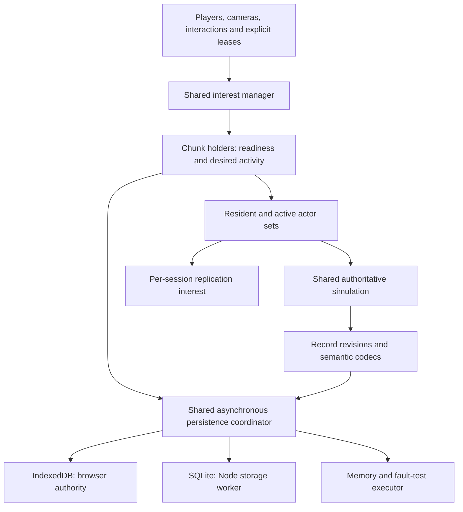

# Target entity persistence and streaming architecture

Status: implementation in progress, 2026-10-03.
The user authorized end-to-end implementation and a new save format without
compatibility with existing worlds. Incremental records and lazy residency are
implemented, including world containers, traffic and pressure admission.
026 is completing integration validation and the final lifecycle audit.
This document records the selected contract; [the topic](topics/entity-activation.md) owns actual delivery
status, [the research](research/entity-streaming-reference.md) distinguishes
Minecraft/mclone evidence from Tilefun choices, and
[Tactical 019](tactical/019-entity-streaming-and-persistence.md) sequences work.

## Outcome and constraints

Saving one changed actor must not serialize every actor. Opening a world must
not read every visited chunk. Travel must release obsolete terrain, actors,
indices and decoded storage caches. Simulation must depend on explicit demand
and ready collision data, with consistent behavior in single-player and on a
dedicated server.

Use one shared authoritative implementation with asynchronous persistence:
IndexedDB in browser authority and SQLite on Node. SQLite is an embedded
database, not a separately administered database service. A future file adapter
must meet the same transaction/recovery contract; independent file renames are
insufficient. There is no initial file-backend requirement.

Use a new versioned save namespace/schema. Do not build legacy readers,
migrations or dual-write paths. Present old worlds as incompatible with an
explicit reset/delete workflow; do not silently reinterpret or erase them.
This save-format decision does not change immutable generator revisions or
approved art identities.

## Ownership

The server owns identity, codecs, dirty tracking, scheduling, residency and
failure policy. Backend adapters own records, indices, transactions and storage
errors. They do not decide whether an NPC exists, simulate it, or independently
merge game data. Clients receive replicas; they do not fetch authoritative
entity records from storage.

### One server implementation, injected host adapters

This is a required invariant for every phase: the integrated browser server,
browser P2P host and dedicated Node server execute the **same authoritative
server modules**, not separate implementations that merely implement matching
interfaces. Extend the existing `GameServer`/`Realm` core. Do not introduce a
`BrowserRealm`, `NodeRealm` or platform-specific persistence coordinator.

Keep these responsibilities shared: simulation and AI, ticket aggregation,
readiness, loading/eviction decisions, durable codecs and identity, dirty
revisions, batching/coalescing, save scheduling, retry/backpressure policy,
flush/close barriers, transitions and replication message construction.

Host entry points assemble narrowly typed dependencies:

| Boundary | Platform-specific responsibility |
| --- | --- |
| Storage executor and world catalog | IndexedDB or SQLite record/index/transaction operations and catalog IO; report typed completions/capabilities to shared policy. |
| Transport | Worker messages, WebSocket or WebRTC delivery behind the shared protocol/transport contract. |
| Host lifecycle and scheduling | Browser visibility or process signals, timer wakeups and storage-worker startup. Request shared pause/flush/close operations; do not implement a second save or simulation loop. |
| Platform services | Writer-lock primitives, monotonic clock/ID entropy, logging and host access-policy hooks where required. |

Admission limits and supported storage durability may be explicit capabilities
or configuration; they cannot silently select a second algorithm. Given the
same seed, commands, simulation steps and configuration, hosts must obey the
same gameplay and persistence semantics. Wall-clock IO completion times and
browser/process lifecycle events naturally differ.

`GameServer` now requires injected transport, registry and store dependencies.
Concrete browser adapters live in the browser host composition entry point. Shared domain code must not import
IndexedDB, SQL, filesystem or DOM implementations or branch on host type to
decide gameplay/save behavior. Adapter interfaces should reflect demonstrated
needs, rather than a framework for hypothetical hosts.

The shared coordinator submits requests and integrates completions on server
turns. No synchronous SQLite work blocks the simulation loop. Browser code
yields to IndexedDB callbacks instead of pretending asynchronous IO is
synchronous. A world-scoped exclusive writer lease spans open through fully
acknowledged close, including browser tabs. A lock conflict cannot silently
start a second writer. Lock acquisition failure is explicit.

## Storage model

One save container owns a world and its realms, including interiors. Every
spatial key includes realm identity. Runtime/network IDs are transient; actors
and persistent props have stable durable IDs. Loading assigns fresh runtime
IDs and resolves saved relationships through durable IDs.

| Record family | Key / index | Contents and rules |
| --- | --- | --- |
| World and realm metadata | World or realm ID | Small versioned configuration, seed/revision identity and realm descriptors. No entity arrays, global edit maps or runtime ID allocator. |
| Terrain override | Realm + chunk coordinate | Only edited terrain/roads/heights and relevant override state; independently revisioned. Clean deterministic generated terrain can be discarded. |
| Entity | Durable entity ID; secondary index on realm + chunk + ID | Versioned kind/state payload, revision and indexed location in one record. Moving or saving an actor does not rewrite its neighbors. |
| Persistent prop | Durable prop ID; same spatial index pattern | Authored placement and durable overrides; definition-derived render/collision data is reconstructed. |
| Procedural feature override | Stable generator feature identity; source and destination spatial indices | Deletion or edited/moved state. The origin lookup suppresses the original feature even if its replacement now belongs to another chunk. No world-wide tombstone list. |
| Procedural actor initialization | Realm + generator revision + origin chunk | Records that initial actor population was seeded, including an empty population. Created actors and the marker commit together. |
| Player | Stable player/profile ID within world | Durable gameplay state and durable references, independent of connection ID. |
| Room/other authored data | Owning room or bounded object ID | Independently loadable records instead of additions to one growing metadata blob. |

Use native secondary indices in SQLite and IndexedDB, with index fields in a
shared record envelope. Do not implement location membership as one giant
per-chunk ID array that must be rewritten whenever an actor moves. Chunk index
queries return bounded pages; entity payloads remain individually addressed.
Index updates and payload changes share a transaction.

Clean procedural static props may regenerate from their pinned generator plus
local overrides. Dynamic generated actors become durable actors on first
initialization. Their origin marker survives moving, death and emptying the
chunk, so revisiting cannot respawn the initial population. Any later gameplay
spawner has its own explicit state and policy. A load failure is never treated
as an empty, uninitialized chunk.

### Semantic state

Each entity kind owns a versioned codec and an explicit durable/transient field
inventory. Persist identity, position and relevant vertical/motion state,
gameplay timers, routes/progress and relationship targets where those affect
continuity. Persist edited attributes only when their owner declares them
durable; today's ephemeral script tags/attributes must not accidentally acquire
new semantics. Reconstruct spatial membership, collider/sprite defaults,
interpolation history, render caches and generic animation/tick counters.

Parent/rider relationships use durable references and atomic relationship
mutations. Hydrate connected attachment groups in two phases: allocate identities,
then resolve relationships before publishing or simulating. Their dependency
loads are bounded; invalid references fail validation or follow a documented
per-kind repair rule. A follower target can remain unresolved while dormant;
it must not force an arbitrarily distant target to stay resident.

## Save and load contract

The domain API needs typed record reads, bounded spatial queries, atomic
puts/deletes, flush barriers and acknowledged close. Completions distinguish
success, absence, cancellation/supersession, incompatibility and failure.
An IO error must never manufacture an empty world.

- Mutating a durable field increments its record revision and marks that record
  dirty. Do not discover changes by serializing or comparing every entity each
  frame. Persisted gameplay clocks follow the same rule; generic runtime clocks
  do not. Coalesce repeated changes to a record within a bounded save interval.
- Snapshot revision `r` and immutable payload for a write. Acknowledging `r`
  clears only work through `r`; a mutation to `r+1` remains dirty. Later writes
  cannot be overwritten by a late older completion.
- Related mutations form one transaction: actor movement and location index,
  pickup and inventory change, attachment changes, seed markers and initial
  actors, or a same-world realm transfer. Do not split an atomic group merely
  to satisfy a batch limit. Bound group size through gameplay/edit limits.
- Cross-world transfer is not covered by a single-world transaction. Keep it
  unsupported until an explicit journal/recovery protocol exists.
- Reads and index queries must account for pending writes/deletes. The shared
  coordinator merges pending changes and reconciles in-flight spatial loads
  against current ownership; it cannot read an old position from disk and
  publish a duplicate after a move. Bounded scans need a defined consistency
  strategy, not an assumption that multiple cursor pages form one transaction.
- Correlate each load with holder generation and demand version. Cancellation
  removes queued work immediately; already executing IO may finish, but its
  obsolete completion cannot recreate a retired holder or actor.
- Save periodically. Flush fences all earlier required mutations; close stops
  new work, drains required writes and releases the writer lease only after
  completion. Browser lifecycle events are a best-effort extra opportunity,
  not the sole mechanism that makes saves happen.

An acknowledgement means the backend transaction committed under its documented
durability mode. IndexedDB and SQLite do not have identical power-loss
guarantees; do not advertise stronger guarantees than the adapter provides.
See [backend evidence](research/entity-streaming-reference.md#backend-decision-evidence).

## Interest, readiness and activity

One interest manager owns tickets with owner, reason, realm, coverage, requested
activity and explicit release/expiry. The strongest applicable demand wins.
Multiple distant players produce a union of local regions, not the bounding
rectangle between them. Releasing a session releases its tickets. Any eviction
grace or TTL uses an explicit clock appropriate to that owner; simulation leases
freeze with a paused simulation, while disconnected-session cleanup must still
run.

| Demand | Intended effect |
| --- | --- |
| Actual player | Full simulation nearby, reduced AI farther away, plus collision-support neighbors. Camera movement cannot remove terrain beneath the player. |
| Camera/editor observer | Bounded residency and replication; viewing alone does not require distant AI. Editing acquires the local readiness/transaction lease it needs. |
| Mount/rider, moving collision group, projectile, teleport or interaction | Bounded temporary dependency demand, with owner and termination condition. No actor implicitly grants itself unlimited permanent residency. |
| Explicit forced area | Optional, separately budgeted and visible in diagnostics; not an accidental exception hidden inside a service. |

Initial full/reduced distances should preserve familiar gameplay where safe;
their final values and zoom limits need measurement. The current camera+2/+8
policy is evidence about current behavior, not the desired invariant.

A chunk holder separates **desired activity**, **readiness**, and **IO state**.
It may be requested/loading, ready, saving for eviction, or failed. A ready
holder may be resident without ticks, reduced-AI, or fully active. Simulation
requires terrain/height/collision dependencies and entity loading to be complete;
generation cannot replace saved state that has not been checked. Prioritize
player safety and interactions before distant view/cache requests, and budget
promotions per turn.

Unknown terrain is not air. Crossing into unready space waits at a defined
boundary or requests a bounded dependency promotion; physics must not
synchronously generate/load arbitrary chunks. Large bodies, fast movement and
attachments require their swept collision/support neighborhood, not only the
chunk containing their center.

### Reduced AI and complete sleep

Separate decision cadence from motion/integration cadence. Full activity uses
the normal server step. Reduced activity may initially use the existing nominal
15 Hz decision rate, but moving bodies and interacting groups still need safe
fixed integration/substeps and ready collision data. Do not apply a large
accumulated movement step merely because an AI decision was deferred, or zero
velocity solely because a decision was skipped. Escalate interacting bodies to
a compatible physics cadence.

Resident sleeping and unloaded actors freeze gameplay timers and movement.
They resume saved semantic state without wall-clock catch-up. Any future
offline progression is a separate explicit feature.

Maintain resident, decision-active and physics-active memberships on transitions.
AI, balls, separation, spatial updates, attachments, tags/overlap services,
spawners and scripts must honor the same lifecycle. Global services may have
explicit world-level schedules, but cannot tick sleeping actors through a
hidden callback. Work should scale with resident/active demand, not every actor
ever authored or every chunk ever visited.

## Eviction and failure

1. On demand loss, demote activity and stop advancing the affected actors. Keep
   required attachment/collision dependencies together; apply a bounded grace
   period where useful.
2. Capture remaining dirty state and submit the required atomic transactions.
   Clean already-committed records need no redundant save.
3. On acknowledgement, recheck revisions, dependencies and current demand.
   Only then remove runtime actors, collision/service memberships, replicas,
   terrain and decoded storage payloads. Eviction is distinct from destruction;
   it creates no death event or procedural tombstone.
4. If demand returns, cancel retirement and reuse valid state. A stale write
   completion cannot evict it. If saving fails, retain dirty state, report an
   unhealthy save condition and retry according to bounded policy.

Queues, decoded caches, pending snapshots, negative/empty lookups and holder
maps need both count and byte limits. Durable writes cannot be silently dropped.
Disposable generated cache writes can be skipped. Give writes fair progress
under continuous reads, and cancel obsolete loads before spending an unload
budget on them. A prolonged storage outage requires backpressure: limit new
edits/streaming or pause advancement with a clear save problem before retained
dirty memory becomes unbounded. No finite cache can accept unlimited durable
mutations during an indefinite outage.

Replication interest remains distinct from simulation. Leaving a client's
interest removes its replica, not the durable actor. Rehydration uses a new
runtime ID or equivalent generation fence so delayed network messages cannot
affect the wrong incarnation. This applies to local Worker transport as well
as remote sessions.

## Acceptance and remaining choices

Required outcomes: one-actor edits write bounded actor/index records; startup
loads only demanded spatial data; fixed-interest travel has bounded retained
memory and queues; sleeping actors receive no gameplay work; active actors
never simulate against missing terrain; save/reload and eviction preserve
identity/state without duplication. Test both real IndexedDB and SQLite, plus
deterministic fault injection. [Tactical 019](tactical/019-entity-streaming-and-persistence.md)
defines the delivery gates.

Implementation must still select the SQLite driver across supported Node
versions, exact record envelopes/codecs, spatial pagination consistency
mechanism, numeric queue/byte budgets, activity distances and per-kind durable
fields. Those choices do not reopen the selected principles: incremental
records, shared policy, atomic mutations, lazy residency and bounded work.
