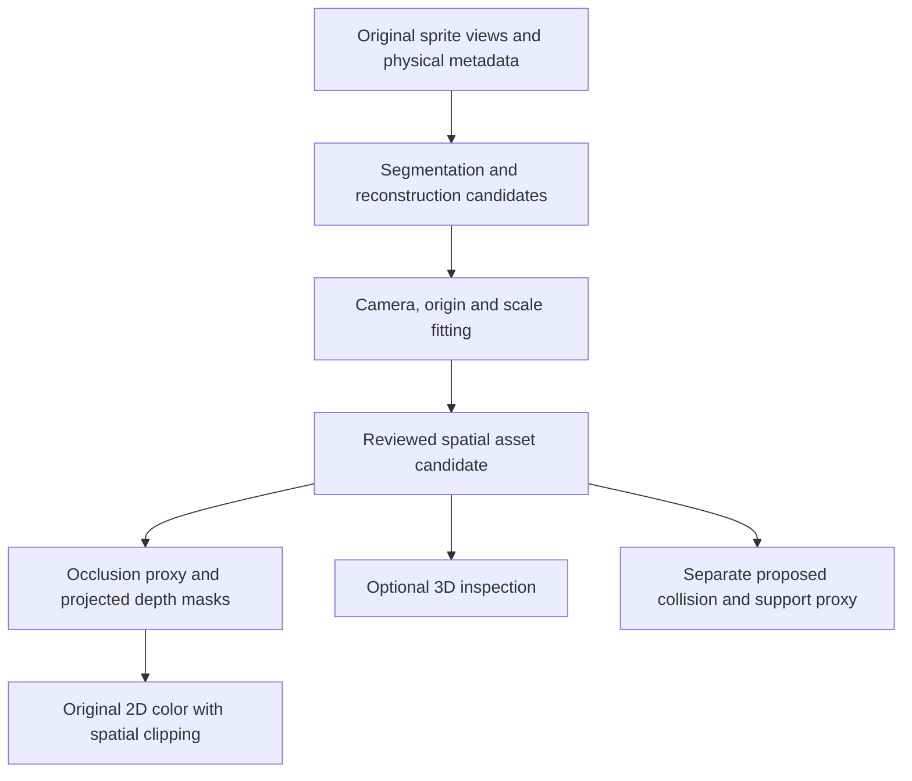

# 070 — Model-assisted spatial assets and sprite clipping investigation

Status: E1–E3 diagnostics execute locally. Original-sprite oak inputs remain flat;
conditioned references now produce volumetric trees. An end-to-end local
SDXL/MV-Adapter/U2Net/TRELLIS.2 pipeline and controlled variants are executed.
Appearance, camera/contact registration, semantic ground roles and actor coverage
remain unreviewed quality limits. E4 is deferred; production clipping is unchanged.
Recorded: 2026-10-07.
Owner: [3D assets](../topics/3d-assets.md). Renderer integration belongs to
[rendering architecture](../topics/rendering-architecture.md); interactive proofs
must follow [embedded engine labs](../topics/embedded-engine-labs.md).

## Objective and owner direction

Investigate an offline pipeline that takes existing sprite art, proposes a 3D
reconstruction, and derives spatial clipping information for the ordinary 2D game.
The same reconstruction should be inspectable in an optional 3D view. Start with
the oak tree and compact car, then test other asset shapes before generalizing.
The next execution environment is the owner's Windows machine with an RTX 4090.
This document is the portable handoff; machine access details stay outside Git.

The immediate motivation is the oak's painted ground shadow covering the player.
Its shadow, trunk and foliage are currently one PNG drawn at one prop sort key.
The owner wants to explore deriving clipping from spatial assets rather than
establishing a large collection of manually painted layer masks. The target is
measurably better overlap behavior, not just an attractive generated model.

This recording task authorizes the documentation and commit. It does not record
experiments as executed, choose a provider, promote generated art, or change the
production renderer. Continue with the experimental slice when taken up on the
GPU machine; no full-engine migration or custom model training is assumed.

## Existing evidence and boundaries

- [037](037-car-projection-experiment.md) and
  [038](038-car-proxy-orthographic-checks.md) project original car artwork onto an
  authored shell. Source registration and coverage pass, but the owner rejected
  the top view. Matching one projection does not establish plausible 3D geometry.
- `src/projection/CarProxy.ts` supplies the pinned car crop and authoring camera;
  `CarProxyScene.ts` supplies source, side, top and orbit inspection. The source
  labelled east actually faces left; verify all facing labels visually.
- The optional GPU mesh body has isolated depth. It does not establish general
  pixel-depth interaction between meshes, sprites, terrain and actors. See
  [042](042-optional-mesh-bodies.md) and [043](043-shared-mesh-pose.md).
- `collectScene.ts` merges props and actors using scalar sort keys;
  `RenderFrame.ts` orders generated shadows separately. The oak's painted shadow
  remains inside its body image. Outdoor metadata already has anchors, ground
  footprints, collider segments and depth offsets, but no per-pixel depth atlas.
- Production movement already has height, collision and support semantics.
  Reconstruction must not silently replace those rules or approved bounds.

The earlier [reconstruction research](../research/sprite-to-3d-and-renderer-options.md)
owns background comparisons. This plan narrows the experiment to spatial clipping.

## Working hypothesis

Fit a candidate mesh to the source camera, silhouette and ground contact. Derive a
simple occlusion proxy and bake depth plus semantic masks in the game projection.
Keep the original sprite as the 2D color image while the derived data determines
which overlapping pixels are in front. Inspect the mesh independently in 3D.

Keep three representations distinct, aligned in world-pixel X/right, Y/ground,
Z/up coordinates:

| Representation | Responsibility |
| --- | --- |
| Visual mesh/materials | Appearance from source and novel views; unseen faces may be inferred |
| Occlusion proxy | Where visible surfaces hide actors; preserve gaps and overhangs |
| Collision/support proxy | Movement blocking, contact and walkable tops; existing physics remains authoritative |

A tree canopy may occlude without blocking walking underneath. A shadow belongs
to a receiving ground surface and does not write solid-object occlusion depth.
Roots, table legs and fences can touch the ground and still occlude. Segmentation
must therefore identify flat ground decoration versus object surfaces, not simply
label everything near Z=0 as non-occluding.

Depth must be distance along a consistently defined camera ray, not just height
or image row. At fixed orthographic projection, a baked depth value and pixel
location can reconstruct a local surface position. Define encoding, units,
near/far direction, invalid pixels and anchor explicitly. Translate those values
with the asset's world pose before comparing overlapping pixels. Transparent
holes must not write depth; shadow compositing remains a separate ground role.

The player needs compatible depth too. Compare a simple upright sprite plane
against a body proxy mapped to the sprite, and inspect head/feet behavior while
jumping. Comparing every tree pixel against only the player's foot depth is not
a complete per-pixel solution. Neither a convex hull that closes table gaps nor
a global canopy overlay is sufficient evidence of correct spatial clipping.

## Small asset corpus

Pin original file hashes, crop coordinates, alpha handling, landmarks, facing,
source-camera assumptions and current physical metadata before generation.
Use oak and car first; add the two secondary cases only after an end-to-end run.

| Asset | Source | What it tests |
| --- | --- | --- |
| Oak | `public/assets/props/oak-tree.png`, 64 × 64 | Painted shadow separation, trunk contact, foliage overhang and player overlap |
| Compact car | `public/assets/tilesets/me-complete.png`; `vehicle:compact-1:*` in `src/traffic/vehicles-v1.json` | Multiple genuine views, wheel contact, roof support and continuous heading |
| Picnic table | `public/assets/props/picnic-table.png`, 48 × 48 | Thin legs, gaps, raised top and avoiding a filled solid-box proxy |
| Beach umbrella | `public/assets/props/beach-umbrella.png`, 48 × 64 | Thin pole and broad overhead cover with a small ground footprint |

The pinned car side body crop is [96,1176,64,40]; the full side selection is
[96,1152,64,64]. Obtain the other source rectangles from the bank and record
their actual visual facing. Do not use the rejected reconstructed top view as an
independent observation. Genuine directional sprites may disagree in proportions.
Generated extra views are hypotheses, not additional ground truth.

For tiny sprites compare nearest-neighbor enlargement with any model-specific
preprocessing. Preserve alpha and record backgrounds. Enlargement adds no observed
geometry. Keep baked lighting in original colors for the initial 2D experiment;
inspect inferred textures unlit before evaluating optional lighting.

## Experiment lanes and practical limits

Compare candidates in identical cameras, positions and clipping paths:

| Lane | Method | Question |
| --- | --- | --- |
| Baseline | Existing Y-sort; simple trunk/canopy or car shell proxy; small manual ground mask only as a reference | What can a cheap spatial model achieve, and what errors remain? |
| Generated geometry | Original images → model mesh → camera/scale fit → simplified occlusion proxy | Does generation reduce authoring effort while retaining useful shape? |
| Hybrid | Constrained/simple geometry with model-assisted segmentation or refinement; optional generated texturing | Are reliable volume and ground separation easier than complete visual reconstruction? |

The desired production workflow is model-assisted derivation. A small authored
baseline is a control for the experiment, not the proposed asset-by-asset pipeline.
Test geometry and occlusion before investing in generated textures: original 2D
color plus good depth may succeed even when the novel-view artwork is imperfect.

Provider facts checked against primary sources on 2026-10-07:

- [TRELLIS.2](https://github.com/microsoft/TRELLIS.2) documents image-to-3D and
  shape-conditioned texturing, GLB export, Linux testing, and an NVIDIA GPU with
  at least 24 GB memory. A 4090 is near that published floor; WSL compatibility,
  usable free VRAM and memory at chosen settings need an actual smoke run.
  Start at the lowest documented resolution. Its GLB example exports opaque
  materials by default despite retaining texture alpha; validate leaf holes and
  material opacity explicitly rather than assuming export preserves occlusion.
- [Hunyuan3D-2.1](https://github.com/Tencent-Hunyuan/Hunyuan3D-2.1) documents
  separate shape/paint stages and approximately 10 GB for shape, 21 GB for paint,
  29 GB combined. Start with shape only; separate processes can release memory
  between stages. This is an experiment strategy, not measured 4090 compatibility.
  Its documented low-VRAM mode is another candidate if needed.
- [NVIDIA CUDA on WSL](https://docs.nvidia.com/cuda/wsl-user-guide/index.html)
  describes using the Windows NVIDIA driver from WSL 2. Do not install a Linux
  GPU driver inside WSL; use the documented toolkit-only route when needed.

Pin the actual provider repository revision, model checkpoint and dependency
versions at execution. Recheck installation and licensing then. Avoid combining
incompatible provider environments. No hosted-service cost is needed for the
initial local comparison; record any later hosted experiment separately.

## Windows / RTX 4090 handoff

1. Read this plan, the 3D assets topic, repository AGENTS.md and the latest car
   evidence. Inspect local changes before updating the checkout. Use Git through
   WSL for every Git operation on Windows; do not assume a particular machine
   path, username, target name or existing inference environment.
2. If remote machine control is needed, use the common CLI and current
   [machine-control guides](https://github.com/kzahel/machine-control). Resolve
   the actual physical workstation from local/private inventory; do not copy
   addresses or target credentials into this repository or assume a VM has GPU
   access. Prefer command-driven diagnostics and captures over manual UI work.
3. Verify WSL 2, GPU visibility and available resources before installing models.
   Run `nvidia-smi` in Windows and WSL; record driver, reported GPU/VRAM, free
   memory, RAM, free disk, OS/WSL versions and competing GPU workloads. In each
   isolated Python environment verify `torch.cuda.is_available()` and the device
   name. Record Python, PyTorch/CUDA and compiled extension versions.
4. Use a WSL Linux filesystem checkout and separate model environments/caches.
   Keep downloaded weights and provider clones outside the Tilefun tracked tree.
   Keep raw experiments in ignored `data/spatial-assets/070/` or an external
   artifact directory, with portable relative artifact references in run records.
5. Run one provider example to separate setup errors from sprite-quality errors.
   Then run one oak and one car at conservative settings before increasing the
   matrix. Measure peak memory/time; record OOMs and unsupported operations rather
   than treating retries with changed settings as identical runs.
6. Export the input manifest, successful candidates, run records and fixed-view
   evidence as a portable bundle. Git carries scripts, small manifests, docs and
   selected review evidence; weights, caches and bulk outputs stay outside Git.
   Large assets need an explicit artifact-storage decision before publication.

The execution record below distinguishes completed setup from unverified inference.
The reproducible CLI and environment recipe are in
[`scripts/spatial-assets`](../../scripts/spatial-assets/README.md).

## Staged execution and checkpoints

### E1 — Inputs, baseline and inference smoke

Create a script-backed corpus manifest and fixed-camera baseline captures. Include
ground axes, source image, silhouette overlay and wireframe. Generate one oak and
one car with a feasible provider; inspect raw output before repairs. Begin with
single-view inputs; use genuine multi-view conditioning only where the chosen
provider supports it. Keep the second provider optional until the first lane runs.

Deliver: reproducible environment/run commands, input hashes, raw mesh, fitting
transform, source/top/side/oblique captures, memory/time and a candid failure list.

### E2 — Derived depth and segmentation

Fit camera, scale and ground contact without changing source pixels. Extract or
propose ground-shadow/object masks and semantic parts. Simplify geometry while
preserving trunk/pole gaps and canopy/table overhangs. Bake source-sized depth,
validity and role masks; capture depth false colors and coverage overlays.

Report pixels where the source is opaque but the mesh has no corresponding
surface, and where the mesh projects beyond source alpha. Do not silently fill
these with arbitrary depths. Try a documented fit/refinement or mark low-confidence
regions; keep corrections and their time separate from raw model output. Retain
original source colors and alpha for the fixed-view 2D comparison.

Deliver: one spatial candidate per primary asset with explicit depth encoding,
projection/anchor, semantic ground treatment, uncertainty and provenance.

### E3 — Clipping proof and 3D inspection

Start with a deterministic compositor that compares baseline and derived-depth
clipping at identical actor poses. Use shared projection conventions and a
declared player depth approximation. A static compositor is diagnostic evidence;
it does not establish production game/lab parity.

Once the comparison is useful, add an opt-in proof through shared scene
presentation and ScenarioPresentationHost. Keep Worker authority, prediction,
movement and physical proxies unchanged. Prototype actual cross-object depth
interaction on GPU; assess Canvas feasibility using masks/depth comparisons or
derived pieces from the same spatial data. Record cost and fidelity of each path;
Canvas support is not automatically delivered by a depth atlas. Partial actor
occlusion cannot generally be represented by one sort key or static sprite split.

Provide source/depth/proxy/optional textured-3D views. The 3D view consumes the same
candidate origin, scale and geometry, not a second unrelated reconstruction.

### E4 — Second shapes and workflow decision

Repeat the successful steps on picnic table and umbrella. Record manual fitting,
mask correction and cleanup minutes as well as inference time. A result that only
works after extensive asset-specific edits does not establish an automated pipeline.
Choose whether to continue generated geometry, constrained proxies, segmentation
assistance, or a simpler fallback based on overlap quality and repeatable effort.

## Required overlap cases and evaluation

Use fixed actor poses plus slow movement sweeps across each overlap boundary;
inspect continuity at fractional zoom and on elevated receiving surfaces.

| Case | Expected evidence |
| --- | --- |
| Oak shadow at front, side and rear | Ground-shadow pixels never hide an actor standing on that receiving surface |
| Oak trunk and canopy | Correct partial hiding while behind/underneath, and no opaque rectangle around foliage |
| Oak jump / canopy support | Actor height/support agrees with occlusion; physics remains unchanged |
| Car near/far side and roof passenger | Correct body overlap and passenger above roof; heading does not cause depth flips |
| Table legs and underside | Open gaps remain open; broad convex proxies do not incorrectly hide the actor |
| Umbrella pole and cover | Pole contact and overhead occlusion remain distinguishable |
| Raised ground and overlapping props | Ground shadows attach to their receiver; no global shadow layer leaking through higher structures |

Score source silhouette/contact error, invalid depth coverage, erroneous hidden
actor pixels at labelled poses, edge flicker, shadow leaks and required manual
effort. Human-labelled overlap expectations are reference judgments, not values
inferred from the candidate being tested. Unknown viewpoints get visual review,
not an invented ground-truth pixel score. Capture runtime mask/depth storage,
triangle/material counts, CPU/GPU cost and load time separately from inference.

Two decisions are independent: is the spatial proxy useful for 2D clipping, and
is the textured mesh acceptable from new views? A convincing turntable without
better overlap fails the first objective; useful clipping need not wait for a
finished all-angle visual mesh.

## Artifact record and validation

Each run needs an ID, Tilefun commit, source hashes/crops, provider/checkpoint
revision, seed and settings, preprocessing, environment versions, hardware,
elapsed/peak-memory measurements, raw-output references, fitting transforms,
corrections, derived masks, captures, known failures and review status. Label
observed, fitted and generated information separately. Failed runs are evidence.

Keep source art and promoted banks immutable. New candidates and changed rendered
pixels follow [art review](../topics/art-review.md); register batches/candidates
before requesting human review, and never infer approval from metrics. Tests use
isolated data/auth and bundled Playwright Chromium; GPU evidence needs full
Chromium rendering. Reap capture processes and preserve the user's normal browser.

Run `npm run typecheck`, `npm test` and `npm run check` for implementation work.
Rendering/integration changes also require build and Playwright, affected game
and lab checks, and `art:catalog` followed by `workshop:manifest`. Streaming or
execution changes additionally require `streaming:bench -- --assert-ready`.
Do not regenerate immutable approval renders to conceal changed output.

## Current handoff and next action

### E1 execution record — 2026-10-07

The owner selected the latest **TRELLIS.2** and authorized account access. The
signed-in account's DINOv3 access request is submitted and awaiting Meta review.
US hardware remains an available fallback; local hardware setup has succeeded
and no remote or hosted inference was needed. No successful model evaluation on
the corpus, approved spatial asset or changed clipping behavior is claimed.

- Windows 11 10.0.26200, WSL 2.6.1/kernel 6.6.87.2 and Ubuntu 24.04.3 expose the
  RTX 4090 (24,564 MiB) to CUDA. Approximately 22 GB VRAM and 45 GiB RAM were
  available during initial checks; Linux filesystem disk availability was 914 GiB.
  Windows driver 610.88; WSL reports UMD driver 610.57.01 and CUDA 13.3 support.
- Isolated Python 3.10.22/PyTorch 2.6.0+cu124 with toolkit-only CUDA 12.4.1,
  xformers 0.0.29.post3, Transformers 4.57.3 and pinned provider/extensions built
  successfully. CuMesh, FlexGEMM, o-voxel and nvdiffrast compiled without provider
  source patches. No Linux GPU driver was installed. An optional apt compiler
  installation encountered an already-interrupted dpkg state; existing GCC 13.3
  compiled the extensions, so that unrelated system state was left alone.
- TRELLIS.2 revision `75fbf0183001ed9876c8dbb35de6b68552ee08bd`, checkpoint
  `af44b45f2e35a493886929c6d786e563ec68364d`, DINOv3 revision
  `ea8dc2863c51be0a264bab82070e3e8836b02d51`, and upstream sparse-structure
  decoder revision `25e0d31ffbebe4b5a97464dd851910efc3002d96` are pinned.
  The public 512 checkpoints downloaded successfully. Older TRELLIS was considered
  during setup but not run; the chosen generator is TRELLIS.2.
- [Inputs](070-spatial-assets/inputs.json) pin eight original/nearest-neighbor
  crops, RGBA/file hashes, anchors, genuine directional facing and existing
  physical metadata. Secondary inputs are recorded but are not yet generation
  experiments. No full landmark fit is claimed. Sources and promoted banks remain
  unchanged.
- [Oak control](070-spatial-assets/oak-control.png) uses a simple authored crown
  and trunk; [car control](070-spatial-assets/car-control.png) uses the existing
  neutral CarProxy shell. CUDA raster outputs include source/top/side/front/back/
  oblique depth, coverage and wireframe inspection, explicit validity and world
  positions. Colors normalize independently per view and are not generated
  textures. Controls have no reviewed ground-shadow/object segmentation.
- The source-sized depth protocol is float32 signed ray distance `(Y+Z)/sqrt(2)`
  in world pixels, larger nearer, NaN invalid, pixel-center sampling and clip
  range [-128,128]. Original alpha masks depth; missing opaque coverage remains
  invalid. A synthetic CUDA check confirms nearest-surface selection in both
  triangle orders, top-left row orientation and inverse camera reconstruction.
- Example attempt `trellis2-example-001` imported the actual pipeline and stopped
  at DINOv3 download preflight with HTTP 401 after 8.92 seconds. It performed no
  model loading or inference. Browser sign-in does not authenticate Python; after
  Meta approval, use local HF authentication or an authorized pinned encoder
  download with `--encoder-dir`. No credentials are included in Git/run records.

| Authored control | Opaque source pixels | Matched | Missing | Mesh beyond alpha | Triangles | First CUDA raster | Depth / validity bytes |
| --- | ---: | ---: | ---: | ---: | ---: | ---: | ---: |
| Oak | 2,291 | 1,703 | 588 | 733 | 368 | 0.413 s | 16,384 / 4,096 |
| Car side body | 1,809 | 1,809 | 0 | 367 | 36 | 0.323 s | 10,240 / 2,560 |

These are geometry coverage diagnostics, not human-labelled overlap scores or
renderer runtime benchmarks. Car coverage does not resolve the owner's rejected
top view. The oak control visibly mismatches canopy silhouette and ground pixels.
Geometry alone does not distinguish shadows, roots and solid-object surfaces.
Bulk meshes/depth/caches stay outside Git or in ignored `data/spatial-assets/070/`;
[environment and attempt record](070-spatial-assets/environment.json) and selected
control evidence are portable. No candidate review has been requested.

Next: once DINOv3 access is granted, run the provider example with a new immutable
run ID, then oak and car at seed 1/512 resolution/twelve steps per sampler/low-VRAM
settings. Record actual load/inference memory and time, inspect raw outputs, then
perform explicit camera/scale fitting and E2 segmentation. The control compositor
below prepares E3; generated-candidate comparison, game/GPU integration and E4
secondary-shape experiments remain unimplemented.

Execution validation: repository typechecks and the CUDA projection check pass.
Lint and input-manifest reproduction pass; lint retains existing warnings and
information. The native Windows unit suite reports 1,728 passing, five failing and ten skipped
tests across 207 files: existing file-symlink fixtures hit EPERM and the existing
SQLite process-death test expects POSIX SIGKILL reporting. No changed runtime file
is involved. Python syntax checks and `git diff --check` also pass.
No game/lab integration or render-recipe change was made, so build/browser parity
and inventory regeneration are not applicable to this offline setup checkpoint.

### Work during DINOv3 review — 2026-10-07

The owner asked to continue investigation during the access wait and then directed
large storage away from the nearly full system drive. The environment's 68.5 GiB
WSL disk was relocated to a secondary drive using the installed WSL `--manage
--move` command. Native Linux paths and compiled environments remain intact;
CUDA validation and cached public checkpoint reads passed after relocation.
System-drive free space rose from approximately 14 to 82 GiB. The ignored experiment
bundle also moved to the secondary drive, with a directory junction preserving
existing CLI paths. Concrete machine paths remain in the local storage note.

[`compare.py`](../../scripts/spatial-assets/compare.py) now performs a deterministic
CPU compositor over the CUDA-baked controls and original classic idle player
pixels. [Actor provenance](070-spatial-assets/actor.json) is extracted from
`createPlayer`; the eight model-input manifest values remain unchanged. This is a
static reference adapter permitted by the embedded-labs boundary, not a second
interactive game host. Poses are authored probes without a simulation/support
claim; production collision and presentation are unchanged.

Five lanes use identical source colors and actor poses: a scalar Y+Z reference,
per-pixel object depth against actor foot depth, an upright actor plane, a proposed
ground role plus that plane, and the same ground proposal plus a capsule actor
body. Scalar sorting intentionally excludes production `depthAboveProps` and
support overrides and gives the object ties. The capsule is a visual hypothesis
with X/Y radii 5/3 and Z bounds 0–16, not replacement physics (the source player
has a 10×6 footprint and physicalHeight 12). Missing depth falls back to the scalar
reference and is counted/highlighted explicitly.

The oak ground-role proposal is deliberately cheap and unreviewed: opaque pixels
at source row ≥46 with G>1.35R and G>1.2B. It selects 297 pixels, retains original
colors and does not establish accepted shadow segmentation. Brown root pixels
stay in the object lane. Depth alone cannot recover that role. No overlap labels
or approvals were invented, and no candidate review has been requested.

Evidence: [oak comparison](070-spatial-assets/oak-overlap.png),
[car comparison](070-spatial-assets/car-overlap.png), and
[full diagnostic record](070-spatial-assets/comparison.json), run
`control-overlap-004`. Counts below measure behavior/disagreement, **not errors
against human ground truth**.

| Pose | Overlapping actor pixels | Scalar hidden | Foot-depth hidden | Plane hidden | Ground proposal + plane hidden | Ground proposal + body hidden |
| --- | ---: | ---: | ---: | ---: | ---: | ---: |
| Oak front | 126 | 0 | 76 | 0 | 0 | 0 |
| Oak side ground | 151 | 151 | 151 | 151 | 75 | 75 |
| Oak jump | 150 | 0 | 150 | 150 | 150 | 126 |
| Car near side | 104 | 0 | 90 | 0 | 0 | 0 |
| Car jump | 77 | 0 | 77 | 45 | 45 | 18 |

Findings and limits:

- Foot-only actor depth hides the head in the front/near-side control cases that
  the upright plane keeps in front. A separate analytic pixel test demonstrates
  this failure without depending on a human-labelled mesh judgment.
- The proposed ground role exposes 76 overlapping actor pixels in the oak side
  probe. It produces the same result with actor and oak translated onto the same
  raised receiving plane. This is a conditional semantic comparison, not approval
  of those 297 labels or a test of intervening elevated structures.
- The capsule covers 140 of 172 opaque player pixels, leaving 32 without surface
  depth. In the oak jump it has 24 unresolved overlapping pixels; **all** its
  difference from the semantic plane comes from fallback on those unknowns.
  Visible vertical strips are a coverage failure, not evidence that capsule depth
  is better. In the car jump, 24 resolved pixels differ from the plane, but no
  human judgment establishes which approximation is preferable.
- Both assets have 81-frame quarter-world-pixel movement sweeps, displayed with
  nearest sampling at 1.5× zoom. Their per-frame image changes and unresolved
  counts are saved in the ignored bundle. These expose raster phase/uncertainty;
  they do not establish production fractional-zoom continuity or GPU interaction.
- First comparison `control-overlap-001` found an incorrect capsule origin
  (Z=-4..12); its failure record is retained. Subsequent runs correct grounding
  with an assertion of Z=0..16. Images, sweeps, capsule mesh and depth reproduce
  byte-for-byte across the last two runs. Timings include Python/image preparation
  and are not renderer runtime benchmarks.

Validation: analytic compositor checks pass for depth order, raised translations,
NaN fallback, alpha holes, ground roles, translucent color composition and pixel
placement. CUDA projection checks still pass. Repository typechecks/lint pass;
the full native Windows suite reproduces the same five platform failures and ten
skips, with 1,728 passing tests. No game/lab integration was changed.

Next investigation: improve and explicitly inspect actor-proxy coverage before
trusting body-versus-plane differences; compare a segmentation candidate against
source roots/shadow boundaries. Feed successful TRELLIS.2 oak/car outputs through
the same compositor once access permits inference. Keep the manual/color control
separate from the desired model-assisted asset workflow.

Underlying-data handoff: `inspect_data.py` exposes the actual original RGBA,
297-pixel row/color proposal, control depth/positions, vertices/faces and player
plane/capsule data in a pixel-selectable inspector, with JSON alongside it in the
ignored bundle. Values display at 0.001 precision; original float32 arrays remain
unchanged. This makes the authored assumptions visible: no mask was painted,
thresholds and primitive shapes were chosen manually, and no TRELLIS.2 output
has entered these comparisons. The current deliverable is the control/testing
pipeline, not a completed sprite-to-spatial-asset reconstruction pipeline.

Documentation checkpoint validation (2026-10-07): typechecks, all 1,743 unit tests
across 207 files, and lint pass; lint reports existing warnings/information and
applies no fixes. Local links in all four changed documents resolve, and
`git diff --check` passes. No rendering/integration change was made, so browser
captures, inventory regeneration and GPU inference remain execution work.

### DINOv3 approval and download handoff — 2026-10-07

The owner's approval email names ConvNeXt Large. Reloading the signed-in
ViT-L repository confirms “You have been granted access to this model” for
`facebook/dinov3-vitl16-pretrain-lvd1689m`, the encoder required by TRELLIS.2.
Its current commit still matches the pinned
`ea8dc2863c51be0a264bab82070e3e8836b02d51` revision. Public Hub metadata reports
`model.safetensors` at 1,212,559,808 bytes with SHA-256
`dcb2e45127cccbf1601e5f42fef165eea275c8e5213197e8dcf3f48822718179`, and the
745-byte `config.json` at Git blob
`ab2a8b183fd4fd5213e9898a7f499c7c857b1a86`.

Supported browser downloads timed out without a returned file. Browser policy
also blocks inspection of Chrome's internal download manager; no alternate
browser-control mechanism was used to circumvent that restriction. The normal
WSL Hugging Face credential store is unauthenticated. The owner was asked to
complete CLI login in their terminal, keeping the token out of chat and run
records. The existing CLI executable was verified. Downloads and experiment
outputs remain on the secondary drive.

Local encoder mode now verifies both required file sizes and checksums against
Hub metadata at the requested immutable revision before loading weights.
Inference has not yet run successfully. Once CLI authentication is available,
resume the retained provider-example recipe, then oak/car generation, explicit
camera fitting and depth comparison; account approval alone is not an inference
result.

Approval checkpoint validation: Python compilation and rejection probes against
the actual pinned Hub metadata pass for truncated and corrupted local config
files. Typechecks, lint and `git diff --check` pass. Native Windows tests report
1,728 passing, five failing and ten skipped; failures are the previously observed
symlink EPERM and SIGKILL-reporting issues. No production renderer was changed.

Download follow-up: the owner reported a JSON file in Downloads and authorized
local use. The actual file is `config.json`, not a credential. Its 745 bytes match
the pinned Git blob; a copy now lives with the secondary-drive encoder files.
The browser weight request reaches a Chrome `ERR_BLOCKED_BY_CLIENT` page for
Hugging Face's CDN. No blocked browser surface or restriction was bypassed.
Windows window inspection found no active save dialog.

The signed-in account has one existing read token whose full value is not
recoverable through the visible token menu. It was left unchanged. A new
fine-grained token form named `tilefun-trellis2-dinov3` is prepared with only
read access to the selected ViT-L repository; the site also inherently permits
public-repository reads. No token was created. Creating a persistent API key
requires action-time confirmation under the browser-control policy, so that
final step awaits the owner. Once confirmed, use it through normal local Hub
authentication, verify the encoder bytes and resume the provider smoke run.

### Authenticated TRELLIS.2 execution and quality gate — 2026-10-07

The owner confirmed creation of the prepared repository-scoped read token. It was
created and placed in the normal local Hugging Face credential store; no secret
entered source, commands, captures or run metadata. The CLI downloaded the pinned
ViT-L encoder and verified both files against the sizes and Git/LFS digests above.
Heavy environment, cache and output storage remains on the secondary drive.

Five inference runs succeeded with pinned TRELLIS.2, the 512 pipeline, xformers,
FlexGEMM, low-VRAM mode and twelve steps per sampler (the upstream default).
RGBA inputs bypass the unused background-removal model. Provider preprocessing
uses its alpha bounding box and black composite; the actual provider crop is saved.
The provider example validates execution, not sprite quality. These are single
timing observations, not repeated performance benchmarks. Reserved memory covers
PyTorch allocations, not all GPU/process memory.

| Run | Input / seed | Inference seconds | End-to-end seconds | Raw triangles | Raw X/Y/Z extents | Observation |
| --- | --- | ---: | ---: | ---: | --- | --- |
| `trellis2-example-002` | Provider T / 1 | 60.93 | 118.28 | 3,647,642 | 1.000 / 0.386 / 0.892 | Volumetric example |
| `trellis2-oak-001` | Nearest 512 / 1 | 53.80 | 97.93 | 1,239,212 | 1.000 / 0.023 / 0.933 | Near-flat tree and painted ground |
| `trellis2-car-001` | Nearest 512 / 1 | 19.44 | 64.22 | 991,006 | 0.434 / 1.000 / 0.451 | Volume, boxy body and weak wheels |
| `trellis2-oak-original-001` | Original 64 / 1 | 10.12 | 75.71 | 523,302 | 1.000 / 0.00014 / 1.000 | Almost a plane |
| `trellis2-oak-seed42-001` | Nearest 512 / 42 | 12.45 | 56.65 | 923,644 | 0.879 / 0.00027 / 1.000 | Almost a plane |

All five meshes are non-watertight. Peak allocated/reserved PyTorch memory was
about 2.62–2.63 / 2.67–3.48 GiB. This establishes compatibility of this configured
512 path with the local RTX 4090; it does not establish 1024/1536 requirements.
No older TRELLIS generator was substituted. Changing enlargement or seed alone
did not resolve oak volume in these three observations; this is not an exhaustive
prompt/conditioning experiment.

Untouched provider-returned geometry and voxel/PBR arrays are retained in each
run's `raw.npz`, with geometry-only `raw.glb`, input hashes, model revisions,
settings, timing and memory in `run.json`. Upstream internal hole filling precedes
the returned mesh. Later runs also retain the inference/checkpoint scripts and
voxel origin/size/layout; the example preceded that metadata addition.
[Portable run measurements](070-spatial-assets/inference-summary.json),
[raw oak views](070-spatial-assets/oak-generated-raw.png) and
[raw car views](070-spatial-assets/car-generated-raw.png) expose the result.
`inspect_raw.py` uses six declared orthographic cameras and uniform display fits;
its false-depth colors are independently normalized, not recovered textures.

Only the volumetric car proceeds through registration. `fit.py` searches 216
yaw/pitch/uniform-scale candidates with integer image shifts against original
alpha. A 46,757-triangle simplified proxy accelerates search; the final bake uses
all 991,006 raw triangles. No per-vertex repairs or nonuniform scaling occur.
The [recorded transform](070-spatial-assets/car-generated-transform.json) selects
yaw 270°, pitch -15°, uniform scale 48.772 and silhouette IoU 0.793. Minimum proxy
Z is grounded at zero, but contact, camera and physical origin remain inferred.
Silhouette agreement cannot determine those constraints.

The [generated car bake](070-spatial-assets/car-generated-bake.png) covers **1,550
of 1,809 opaque source pixels**, with **259 unknown** and **146 mesh pixels outside
source alpha**. Original colors remain untouched. Portable
[float32 depth](070-spatial-assets/car-generated-depth.npy),
[surface XYZ](070-spatial-assets/car-generated-positions.npy) and
[bake metadata](070-spatial-assets/car-generated-bake.json) accompany the images.
The interactive data inspector includes these exact source-sized depth/XYZ arrays;
its wireframe is labelled as decimated display geometry, not the depth mesh.

`generated-car-overlap-001` feeds the fitted raw car depth into the existing static
compositor, retaining the authored oak control, original colors and actor probes.
See [comparison record](070-spatial-assets/generated-comparison.json) and
[original-color overlap sheet](070-spatial-assets/car-generated-overlap.png).
For the car near-side probe, scalar/plane/body hide 0/104/70 overlapping pixels;
the body has 26 unknown overlap pixels. At the jump probe they hide 0/77/64,
with seven unknown body pixels. The calibrated shell's plane hides 0 and 45 in
those probes. These differences expose registration/depth sensitivity, not errors
against invented human labels. Probe poses do not establish legal support against
the generated geometry, and capsule coverage is still incomplete.

**Outcome:** the computational sprite → generated geometry → explicit transform
→ source-sized depth → overlap diagnostic path works. Its quality gate fails to
establish useful general clipping: oak lacks volume, car alignment/coverage is
unresolved, and painted-ground semantics remain a separate heuristic. There is
no accepted generated asset, human approval or production game/lab integration.
E4 table/umbrella runs stay open until the primary assets give useful results.

Next bounded work: constrain car registration with source-camera, wheel-contact,
footprint and origin evidence; investigate oak conditioning that distinguishes
volumetric crown/trunk from painted ground. Improve actor coverage before trusting
body-depth differences. Register candidates before requesting human art review.

Execution validation: typechecks and lint pass (118 existing warnings, 34 infos);
Python compilation and analytic CUDA projection/compositor checks pass. Focused
bundled headless Chromium checks confirm generated-car counts, selected pixel
values, geometry rotation, layer switching and desktop/mobile layout without
runtime errors. The full native Windows suite reports 1,727 pass, six failures
and ten skips: five previously reproduced symlink/SIGKILL platform failures plus
one Workshop timeout. The affected Workshop file passes all 13 tests in isolation.
No production rendering/integration change was made. Diff whitespace checks pass.

### Conditioning pipeline and controlled experiments — 2026-10-07

The owner requested a complete runnable local pipeline and several actual
experiments, allowing built-in hosted image generation only to test hypotheses.
That scope is executed: source → recorded conditioning reference → learned alpha
→ latest pinned TRELLIS.2 → untouched geometry/voxel attributes → raw novel views
→ coarse degeneracy checks → explicit source fit → original-color depth/overlap
diagnostics → separately simplified textured GLB → orbit viewer and artifact report.
The Windows launcher and [workflow documentation](../../scripts/spatial-assets/README.md#end-to-end-local-conditioning-pipeline)
coordinate the installed WSL environments. No production sprite, renderer,
collision/support rule, asset promotion or approval record changes.

The hosted hypothesis uses the frozen original oak and
[solid-tree prompt](../../scripts/spatial-assets/prompts/oak-solid-reference.txt).
Built-in image generation returned actual transparent RGBA, 1402×1122. Source,
request, prompt, PNG and SHA-256 are retained. Hosted generation exposes neither
a reproducible seed nor immutable model revision; its saved bytes are the replay
boundary. This is an interpreted solid tree, not a deterministic upscale. It
changes leaf detail, lighting, ground and shape cues as well as resolution.

The local branch uses pinned SDXL base/fp16 VAE, img2img, a
[saved short prompt](../../scripts/spatial-assets/prompts/oak-local-views.txt),
and CPU U2Net cutouts. The original NN512 RGBA is nearest-enlarged to 1024² and
composited over RGB128. Image seed 42, nominal steps 50 and guidance 5 are fixed;
conditioning strength is varied. Strengths 0.55/0.8/0.95 perform 27/40/47 denoising
steps respectively. This variable changes both how much original appearance is
retained and the denoising count. It is not an isolated “more steps” experiment.

An additional pinned local MV-Adapter/SDXL branch jointly generates six
orthographic view hypotheses (768², 50 steps, seed 42, guidance 3, reference scale
1 or 0.35, DDPM with interpolated ShiftSNR 8). Raw RGB views, U2Net masks/cutouts,
actual camera controls and package/model versions are saved. **Angle 0 is selected
in advance for single-view TRELLIS.2.** The other views are consistency evidence,
not joint TRELLIS inputs or independent observations. See the
[official workflow](https://github.com/huanngzh/MV-Adapter/blob/main/scripts/inference_i2mv_sdxl.py).
No Hunyuan/Omni/Tripo reconstruction has been executed in this investigation.

All rows below use the same pinned TRELLIS.2 512 path and twelve sampler steps.
Unless noted, mesh seed is 42. Counts refer to the unchanged original oak's
2,291 opaque pixels, including its painted ground. Timing is one observation of
the TRELLIS inference process including load/output, not a repeated benchmark or
the entire preceding image-generation workflow.

| Run | Conditioning | Raw triangles | TRELLIS process seconds | Matched / unknown | Agent observation |
| --- | --- | ---: | ---: | --- | --- |
| `trellis2-oak-reference-001` | Hosted solid tree | 4,862,750 | 90.64 | 1,873 / 418 | Crown/trunk volume |
| `trellis2-oak-reference64-001` | Same hosted image, LANCZOS max-side 64 | 609,138 | 93.63 | 1,989 / 302 | Tiny tree on a large plane; misleading coverage |
| `oak-local-sprite-004` | MV-Adapter directly from sprite, scale 1 | 3,656,720 | 63.24 | 1,593 / 698 | Extruded-card views; TRELLIS box |
| `oak-local-sprite-soft-001` | Same, scale 0.35 | 3,559,920 | 63.29 | 1,592 / 699 | Box again |
| `trellis2-oak-sdxl055-001` | Local SDXL strength 0.55 | 2,236,480 | 60.76 | Stopped before fit | Flat card; retained painted ground |
| `trellis2-oak-sdxl08-001` | Local SDXL strength 0.8 | 12,472,504 | 95.90 | 1,900 / 391 | Volumetric lobes/trunk; blotchy generated textures |
| `trellis2-oak-sdxl08-seed1-001` | Identical local 0.8 reference, mesh seed 1 | 16,068,472 | 95.79 | 1,944 / 347 | Volume again; same texture problem |
| `trellis2-oak-sdxl095-001` | Local SDXL strength 0.95 | 5,071,232 | 68.12 | 1,907 / 384 | Volume and more coherent texture; larger interpretation drift |
| `oak-local-hosted-001` | Local MV-Adapter from hosted solid reference | 7,895,828 | 70.35 | 2,037 / 254 | Plausible generated tree; silhouette fit still unconstrained |
| `oak-local-sdxl08-001` | Local MV-Adapter from local SDXL 0.8 | 4,907,068 | 82.69 | 1,889 / 402 | Volume and more legible generated color than direct 0.8 |
| `oak-local-full-seed1-001` | Complete local 0.8+MV launcher, mesh seed 1 | 14,977,324 | 94.71 | 1,966 / 325 | Volume persists; mottled texture and small surface fragments |

The same source-sized bake/compositor runs on each volume, with original colors
and the authored car control. The local 0.8+multiview candidate projects 90 pixels
outside original alpha. The hosted+multiview candidate projects 212 outside.
These are candidate transforms found by silhouette search, not established
camera/contact/footprint registration. Good coverage cannot resolve painted
ground roles or prove correct player overlap.

**Finding:** a clearer solid-tree interpretation can make TRELLIS produce useful
volume where the original sprite repeatedly produces a card. A local conditioning
workflow is feasible on the owner's hardware. The high-reference downsample
shows input detail/resolution affects this case, but confounds remain and one
sample is not a general causal claim. Two mesh seeds on identical local reference
bytes support volume feasibility; they do not establish robust reconstruction.
The repeated SDXL seed-42 reference PNGs are byte-identical here. The simpler 0.95
route and local 0.8+multiview route are retained alternatives. The latter is the
default experimental launcher because it improves appearance while retaining
the local reference's broad lobe/trunk interpretation. No candidate is accepted.

`pipeline.py` screens minimum axis extent ratio, boundary-box surface area and
area-weighted normal concentration. Synthetic cards/boxes/floors and a rounded
control exercise those checks. The original box run was captured before the box
screen was added; its measured boundary area is about 0.859 and would now stop.
The 64-pixel tree-on-plane failure passes the coarse metrics. This counterexample
is retained: numerical screening is insufficient and raw novel-view inspection
remains required. No screen is a human approval or automatic shape-quality score.

Export uses upstream cleaning/decimation, UV unwrapping and voxel PBR sampling,
targeting 50,000 triangles and 1024² textures. Its topology is separate from the
unchanged raw bake. Raw Z-up becomes GLB Y-up `[x,z,-y]`; the texture inspector uses
that conversion. Raw arrays remain non-watertight. Source-color preservation applies
to the 2D bake, not generated GLB colors. Bundled headless Chromium exercises the
GLB loader, textures, six orthographic cameras, wireframe controls and mobile layout,
then closes the browser. The standalone viewer also supports orbit/zoom.

Retained setup failures include missing matplotlib/jaxtyping and the first img2img
VAE dtype mismatch; pinned requirements and explicit FP16 placement correct them.
The first successful sprite MV trial exceeded CLIP's token budget, so it is not
used as a matched-prompt comparison. Later trials reject overflow and use the
same short prompt. A capture replacement-string bug and initial GLB-axis mistake
have separate retained captures; corrected captures use callbacks and Y-up.
The strength-0.95 model pipeline completed, but its active shell wrapper was edited
while it was running and exited afterward; its viewer was captured separately.
No failed output is silently replaced.

The final complete local launcher with mesh seed 1 succeeded through the artifact
report (17 retained inference records, including earlier failures). Its GLB has
46,154 triangles. This verifies the default sequence with both installed
environments and the Windows/WSL capture/report boundary. Appearance still varies
across mesh seeds. All heavy storage remains on the secondary drive; the observed
remaining space is about 84 GiB system / 125 GiB secondary. No clean-machine
reinstallation, disconnected-cache replay or broad asset-class robustness claim
has been established.

A controlled export of the same `trellis2-oak-sdxl08-001` raw arrays also tests
upstream narrow-band remeshing (band 1, projection 0), holding target triangles and
texture size fixed. It produces 48,843 triangles in 16.13 seconds, but retains the
blotchy colors. This export-only intervention did not fix that candidate's
appearance; the default keeps remeshing off. The hosted reference's direct export
has readable leaf/trunk colors and volume, further supporting the conditioning
hypothesis without requiring a multiview stage.

Portable [conditioning measurements](070-spatial-assets/conditioning/measurements.json)
include eleven conditioned oak runs, source/reference/raw hashes, image/mesh
settings, geometry screens, stage timings, depth coverage and export records.
Selected [local multiview geometry](070-spatial-assets/conditioning/oak-local-sdxl08-001-raw.png),
[local generated appearance](070-spatial-assets/conditioning/oak-local-sdxl08-001-export.png),
[stronger local interpretation](070-spatial-assets/conditioning/trellis2-oak-sdxl095-001-export.png),
[hosted-reference appearance](070-spatial-assets/conditioning/trellis2-oak-reference-001-export.png)
and [low-resolution failure](070-spatial-assets/conditioning/trellis2-oak-reference64-001-raw.png)
are diagnostic previews. Full-size frozen inputs/masks, raw arrays, source-sized
depth/XYZ, comparisons and self-contained viewers remain in the ignored external
bundle's `reports/conditioning-experiments-001/index.html`. The report verifies
406 artifact links with no missing targets. Machine-specific paths stay local.

Final validation: typecheck and lint pass (118 existing warnings, 34 infos).
Python compilation,
shell/PowerShell parsing, reference tamper/duplicate rejection, synthetic geometry,
CUDA projection and overlap checks pass. Executed local/default pipelines and
bundled Chromium captures exercise the cross-environment workflow. The full native
Windows suite has 1,728 passes, five failures and ten skips across 207 files:
the failures are the already-reproduced symlink-permission and SIGKILL platform
cases; the static-file suite also fails setup/cleanup after symlink denial.
No production engine or render integration changes require a build/catalog update.

Next: use a volumetric local candidate to constrain source camera, root contact,
physical origin/footprint and painted-ground semantics, then improve actor depth
coverage and assess original-color overlap. Register review candidates before
requesting human art judgment. E4 remains deferred until primary clipping evidence
is useful; attractive 3D appearance alone does not satisfy that gate.
