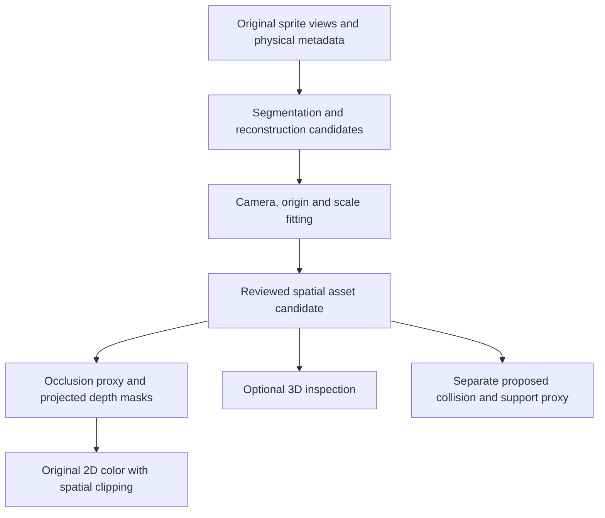

# 070 — Model-assisted spatial assets and sprite clipping investigation

Status: investigation planned; no model runs or clipping implementation yet.
Recorded: 2026-10-07.
Owner: [3D assets](../topics/3d-assets.md). Renderer integration belongs to
[rendering architecture](../topics/rendering-architecture.md); interactive proofs
must follow [embedded engine labs](../topics/embedded-engine-labs.md).

## Objective and owner direction

Investigate an offline pipeline that takes existing sprite art, proposes a 3D
reconstruction, and derives spatial clipping information for the ordinary 2D game.
The same reconstruction should be inspectable in an optional 3D view. Start with
the oak tree and compact car, then test other asset shapes before generalizing.
The next execution environment is the owner's Windows machine with an RTX 4090.
This document is the portable handoff; machine access details stay outside Git.

The immediate motivation is the oak's painted ground shadow covering the player.
Its shadow, trunk and foliage are currently one PNG drawn at one prop sort key.
The owner wants to explore deriving clipping from spatial assets rather than
establishing a large collection of manually painted layer masks. The target is
measurably better overlap behavior, not just an attractive generated model.

This recording task authorizes the documentation and commit. It does not record
experiments as executed, choose a provider, promote generated art, or change the
production renderer. Continue with the experimental slice when taken up on the
GPU machine; no full-engine migration or custom model training is assumed.

## Existing evidence and boundaries

- [037](037-car-projection-experiment.md) and
  [038](038-car-proxy-orthographic-checks.md) project original car artwork onto an
  authored shell. Source registration and coverage pass, but the owner rejected
  the top view. Matching one projection does not establish plausible 3D geometry.
- `src/projection/CarProxy.ts` supplies the pinned car crop and authoring camera;
  `CarProxyScene.ts` supplies source, side, top and orbit inspection. The source
  labelled east actually faces left; verify all facing labels visually.
- The optional GPU mesh body has isolated depth. It does not establish general
  pixel-depth interaction between meshes, sprites, terrain and actors. See
  [042](042-optional-mesh-bodies.md) and [043](043-shared-mesh-pose.md).
- `collectScene.ts` merges props and actors using scalar sort keys;
  `RenderFrame.ts` orders generated shadows separately. The oak's painted shadow
  remains inside its body image. Outdoor metadata already has anchors, ground
  footprints, collider segments and depth offsets, but no per-pixel depth atlas.
- Production movement already has height, collision and support semantics.
  Reconstruction must not silently replace those rules or approved bounds.

The earlier [reconstruction research](../research/sprite-to-3d-and-renderer-options.md)
owns background comparisons. This plan narrows the experiment to spatial clipping.

## Working hypothesis

Fit a candidate mesh to the source camera, silhouette and ground contact. Derive a
simple occlusion proxy and bake depth plus semantic masks in the game projection.
Keep the original sprite as the 2D color image while the derived data determines
which overlapping pixels are in front. Inspect the mesh independently in 3D.

Keep three representations distinct, aligned in world-pixel X/right, Y/ground,
Z/up coordinates:

| Representation | Responsibility |
| --- | --- |
| Visual mesh/materials | Appearance from source and novel views; unseen faces may be inferred |
| Occlusion proxy | Where visible surfaces hide actors; preserve gaps and overhangs |
| Collision/support proxy | Movement blocking, contact and walkable tops; existing physics remains authoritative |

A tree canopy may occlude without blocking walking underneath. A shadow belongs
to a receiving ground surface and does not write solid-object occlusion depth.
Roots, table legs and fences can touch the ground and still occlude. Segmentation
must therefore identify flat ground decoration versus object surfaces, not simply
label everything near Z=0 as non-occluding.

Depth must be distance along a consistently defined camera ray, not just height
or image row. At fixed orthographic projection, a baked depth value and pixel
location can reconstruct a local surface position. Define encoding, units,
near/far direction, invalid pixels and anchor explicitly. Translate those values
with the asset's world pose before comparing overlapping pixels. Transparent
holes must not write depth; shadow compositing remains a separate ground role.

The player needs compatible depth too. Compare a simple upright sprite plane
against a body proxy mapped to the sprite, and inspect head/feet behavior while
jumping. Comparing every tree pixel against only the player's foot depth is not
a complete per-pixel solution. Neither a convex hull that closes table gaps nor
a global canopy overlay is sufficient evidence of correct spatial clipping.

## Small asset corpus

Pin original file hashes, crop coordinates, alpha handling, landmarks, facing,
source-camera assumptions and current physical metadata before generation.
Use oak and car first; add the two secondary cases only after an end-to-end run.

| Asset | Source | What it tests |
| --- | --- | --- |
| Oak | `public/assets/props/oak-tree.png`, 64 × 64 | Painted shadow separation, trunk contact, foliage overhang and player overlap |
| Compact car | `public/assets/tilesets/me-complete.png`; `vehicle:compact-1:*` in `src/traffic/vehicles-v1.json` | Multiple genuine views, wheel contact, roof support and continuous heading |
| Picnic table | `public/assets/props/picnic-table.png`, 48 × 48 | Thin legs, gaps, raised top and avoiding a filled solid-box proxy |
| Beach umbrella | `public/assets/props/beach-umbrella.png`, 48 × 64 | Thin pole and broad overhead cover with a small ground footprint |

The pinned car side body crop is [96,1176,64,40]; the full side selection is
[96,1152,64,64]. Obtain the other source rectangles from the bank and record
their actual visual facing. Do not use the rejected reconstructed top view as an
independent observation. Genuine directional sprites may disagree in proportions.
Generated extra views are hypotheses, not additional ground truth.

For tiny sprites compare nearest-neighbor enlargement with any model-specific
preprocessing. Preserve alpha and record backgrounds. Enlargement adds no observed
geometry. Keep baked lighting in original colors for the initial 2D experiment;
inspect inferred textures unlit before evaluating optional lighting.

## Experiment lanes and practical limits

Compare candidates in identical cameras, positions and clipping paths:

| Lane | Method | Question |
| --- | --- | --- |
| Baseline | Existing Y-sort; simple trunk/canopy or car shell proxy; small manual ground mask only as a reference | What can a cheap spatial model achieve, and what errors remain? |
| Generated geometry | Original images → model mesh → camera/scale fit → simplified occlusion proxy | Does generation reduce authoring effort while retaining useful shape? |
| Hybrid | Constrained/simple geometry with model-assisted segmentation or refinement; optional generated texturing | Are reliable volume and ground separation easier than complete visual reconstruction? |

The desired production workflow is model-assisted derivation. A small authored
baseline is a control for the experiment, not the proposed asset-by-asset pipeline.
Test geometry and occlusion before investing in generated textures: original 2D
color plus good depth may succeed even when the novel-view artwork is imperfect.

Provider facts checked against primary sources on 2026-10-07:

- [TRELLIS.2](https://github.com/microsoft/TRELLIS.2) documents image-to-3D and
  shape-conditioned texturing, GLB export, Linux testing, and an NVIDIA GPU with
  at least 24 GB memory. A 4090 is near that published floor; WSL compatibility,
  usable free VRAM and memory at chosen settings need an actual smoke run.
  Start at the lowest documented resolution. Its GLB example exports opaque
  materials by default despite retaining texture alpha; validate leaf holes and
  material opacity explicitly rather than assuming export preserves occlusion.
- [Hunyuan3D-2.1](https://github.com/Tencent-Hunyuan/Hunyuan3D-2.1) documents
  separate shape/paint stages and approximately 10 GB for shape, 21 GB for paint,
  29 GB combined. Start with shape only; separate processes can release memory
  between stages. This is an experiment strategy, not measured 4090 compatibility.
  Its documented low-VRAM mode is another candidate if needed.
- [NVIDIA CUDA on WSL](https://docs.nvidia.com/cuda/wsl-user-guide/index.html)
  describes using the Windows NVIDIA driver from WSL 2. Do not install a Linux
  GPU driver inside WSL; use the documented toolkit-only route when needed.

Pin the actual provider repository revision, model checkpoint and dependency
versions at execution. Recheck installation and licensing then. Avoid combining
incompatible provider environments. No hosted-service cost is needed for the
initial local comparison; record any later hosted experiment separately.

## Windows / RTX 4090 handoff

1. Read this plan, the 3D assets topic, repository AGENTS.md and the latest car
   evidence. Inspect local changes before updating the checkout. Use Git through
   WSL for every Git operation on Windows; do not assume a particular machine
   path, username, target name or existing inference environment.
2. If remote machine control is needed, use the common CLI and current
   [machine-control guides](https://github.com/kzahel/machine-control). Resolve
   the actual physical workstation from local/private inventory; do not copy
   addresses or target credentials into this repository or assume a VM has GPU
   access. Prefer command-driven diagnostics and captures over manual UI work.
3. Verify WSL 2, GPU visibility and available resources before installing models.
   Run `nvidia-smi` in Windows and WSL; record driver, reported GPU/VRAM, free
   memory, RAM, free disk, OS/WSL versions and competing GPU workloads. In each
   isolated Python environment verify `torch.cuda.is_available()` and the device
   name. Record Python, PyTorch/CUDA and compiled extension versions.
4. Use a WSL Linux filesystem checkout and separate model environments/caches.
   Keep downloaded weights and provider clones outside the Tilefun tracked tree.
   Keep raw experiments in ignored `data/spatial-assets/070/` or an external
   artifact directory, with portable relative artifact references in run records.
5. Run one provider example to separate setup errors from sprite-quality errors.
   Then run one oak and one car at conservative settings before increasing the
   matrix. Measure peak memory/time; record OOMs and unsupported operations rather
   than treating retries with changed settings as identical runs.
6. Export the input manifest, successful candidates, run records and fixed-view
   evidence as a portable bundle. Git carries scripts, small manifests, docs and
   selected review evidence; weights, caches and bulk outputs stay outside Git.
   Large assets need an explicit artifact-storage decision before publication.

These are handoff steps, not commands already executed on the workstation. No
inference runner, model install script or asset manifest exists for this plan yet.
The first execution slice should implement and record the small reproducible CLI.

## Staged execution and checkpoints

### E1 — Inputs, baseline and inference smoke

Create a script-backed corpus manifest and fixed-camera baseline captures. Include
ground axes, source image, silhouette overlay and wireframe. Generate one oak and
one car with a feasible provider; inspect raw output before repairs. Begin with
single-view inputs; use genuine multi-view conditioning only where the chosen
provider supports it. Keep the second provider optional until the first lane runs.

Deliver: reproducible environment/run commands, input hashes, raw mesh, fitting
transform, source/top/side/oblique captures, memory/time and a candid failure list.

### E2 — Derived depth and segmentation

Fit camera, scale and ground contact without changing source pixels. Extract or
propose ground-shadow/object masks and semantic parts. Simplify geometry while
preserving trunk/pole gaps and canopy/table overhangs. Bake source-sized depth,
validity and role masks; capture depth false colors and coverage overlays.

Report pixels where the source is opaque but the mesh has no corresponding
surface, and where the mesh projects beyond source alpha. Do not silently fill
these with arbitrary depths. Try a documented fit/refinement or mark low-confidence
regions; keep corrections and their time separate from raw model output. Retain
original source colors and alpha for the fixed-view 2D comparison.

Deliver: one spatial candidate per primary asset with explicit depth encoding,
projection/anchor, semantic ground treatment, uncertainty and provenance.

### E3 — Clipping proof and 3D inspection

Start with a deterministic compositor that compares baseline and derived-depth
clipping at identical actor poses. Use shared projection conventions and a
declared player depth approximation. A static compositor is diagnostic evidence;
it does not establish production game/lab parity.

Once the comparison is useful, add an opt-in proof through shared scene
presentation and ScenarioPresentationHost. Keep Worker authority, prediction,
movement and physical proxies unchanged. Prototype actual cross-object depth
interaction on GPU; assess Canvas feasibility using masks/depth comparisons or
derived pieces from the same spatial data. Record cost and fidelity of each path;
Canvas support is not automatically delivered by a depth atlas. Partial actor
occlusion cannot generally be represented by one sort key or static sprite split.

Provide source/depth/proxy/optional textured-3D views. The 3D view consumes the same
candidate origin, scale and geometry, not a second unrelated reconstruction.

### E4 — Second shapes and workflow decision

Repeat the successful steps on picnic table and umbrella. Record manual fitting,
mask correction and cleanup minutes as well as inference time. A result that only
works after extensive asset-specific edits does not establish an automated pipeline.
Choose whether to continue generated geometry, constrained proxies, segmentation
assistance, or a simpler fallback based on overlap quality and repeatable effort.

## Required overlap cases and evaluation

Use fixed actor poses plus slow movement sweeps across each overlap boundary;
inspect continuity at fractional zoom and on elevated receiving surfaces.

| Case | Expected evidence |
| --- | --- |
| Oak shadow at front, side and rear | Ground-shadow pixels never hide an actor standing on that receiving surface |
| Oak trunk and canopy | Correct partial hiding while behind/underneath, and no opaque rectangle around foliage |
| Oak jump / canopy support | Actor height/support agrees with occlusion; physics remains unchanged |
| Car near/far side and roof passenger | Correct body overlap and passenger above roof; heading does not cause depth flips |
| Table legs and underside | Open gaps remain open; broad convex proxies do not incorrectly hide the actor |
| Umbrella pole and cover | Pole contact and overhead occlusion remain distinguishable |
| Raised ground and overlapping props | Ground shadows attach to their receiver; no global shadow layer leaking through higher structures |

Score source silhouette/contact error, invalid depth coverage, erroneous hidden
actor pixels at labelled poses, edge flicker, shadow leaks and required manual
effort. Human-labelled overlap expectations are reference judgments, not values
inferred from the candidate being tested. Unknown viewpoints get visual review,
not an invented ground-truth pixel score. Capture runtime mask/depth storage,
triangle/material counts, CPU/GPU cost and load time separately from inference.

Two decisions are independent: is the spatial proxy useful for 2D clipping, and
is the textured mesh acceptable from new views? A convincing turntable without
better overlap fails the first objective; useful clipping need not wait for a
finished all-angle visual mesh.

## Artifact record and validation

Each run needs an ID, Tilefun commit, source hashes/crops, provider/checkpoint
revision, seed and settings, preprocessing, environment versions, hardware,
elapsed/peak-memory measurements, raw-output references, fitting transforms,
corrections, derived masks, captures, known failures and review status. Label
observed, fitted and generated information separately. Failed runs are evidence.

Keep source art and promoted banks immutable. New candidates and changed rendered
pixels follow [art review](../topics/art-review.md); register batches/candidates
before requesting human review, and never infer approval from metrics. Tests use
isolated data/auth and bundled Playwright Chromium; GPU evidence needs full
Chromium rendering. Reap capture processes and preserve the user's normal browser.

Run `npm run typecheck`, `npm test` and `npm run check` for implementation work.
Rendering/integration changes also require build and Playwright, affected game
and lab checks, and `art:catalog` followed by `workshop:manifest`. Streaming or
execution changes additionally require `streaming:bench -- --assert-ready`.
Do not regenerate immutable approval renders to conceal changed output.

## Current handoff and next action

Only the investigation plan is recorded at this checkpoint. No provider has been
evaluated on this corpus, no spatial asset is approved, and no clipping behavior
has changed. The next action on the 4090 is E1: environment/GPU verification,
pinned oak/car inputs, a baseline and the first conservative inference smoke run.
Update this execution record with results and the 3D assets topic with the current
workflow decision before handing off again.

Documentation checkpoint validation (2026-10-07): typechecks, all 1,743 unit tests
across 207 files, and lint pass; lint reports existing warnings/information and
applies no fixes. Local links in all four changed documents resolve, and
`git diff --check` passes. No rendering/integration change was made, so browser
captures, inventory regeneration and GPU inference remain execution work.
