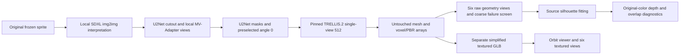

# Spatial asset investigation 070

Offline diagnostics for [070](../../docs/tactical/070-model-assisted-spatial-assets-investigation.md).
The current provider is **TRELLIS.2**, selected by the owner. Reference conditioning
now produces volumetric oaks, including an entirely local SDXL route. Appearance,
source registration and clipping remain unreviewed quality problems. These scripts
do not change gameplay, source art, physics or approval records.

Evidence directories for 070–075 under `docs/tactical/` are local, Git-ignored
outputs, so the evidence links below need those files locally. Keep external
experiment bundles to rebuild reports and preserve exact historical pixels;
model reruns are not guaranteed to be byte-identical, especially the hosted
reference. Recipes and written investigation findings remain in Git; normal
game builds do not require these evidence bundles.

## Environment

Run Python and provider Git commands inside WSL, with providers, virtualenvs,
CUDA and checkpoint caches on its Linux filesystem outside this repository.
`spatial_root` below is an external directory of your choice; `tilefun_root` is
the repository's Linux-visible path. The observed configuration is Python
3.10.22, uv 0.12.23, PyTorch 2.6.0+cu124, torchvision 0.21.0+cu124,
xformers 0.0.29.post3 and CUDA toolkit 12.4.1. Full package/hardware records are in
[environment.json](../../docs/tactical/070-spatial-assets/environment.json).

Clone these official repositories into `providers/`, at these revisions; initialize
their recursive submodules. Existing checkouts should be inspected before use.

| Directory | Repository | Revision |
| --- | --- | --- |
| TRELLIS.2 | https://github.com/microsoft/TRELLIS.2 | `75fbf0183001ed9876c8dbb35de6b68552ee08bd` |
| CuMesh | https://github.com/JeffreyXiang/CuMesh | `12289e1062f0603f2f0d0771b02e1395d247f26f` |
| FlexGEMM | https://github.com/JeffreyXiang/FlexGEMM | `6dd94a859c26ee8246888502eada3dd8ad85532e` |
| nvdiffrast | https://github.com/NVlabs/nvdiffrast | `253ac4fcea7de5f396371124af597e6cc957bfae` (v0.4.0) |

Create `envs/bootstrap` with Python 3.12 and install uv 0.12.23 there. The toolkit
installer needs Python 3.12's safe tar extraction API. Create
`envs/trellis2-py310` with uv's Python 3.10.22. Install the GPU wheels separately:

```bash
python3 -m venv "$spatial_root/envs/bootstrap"
"$spatial_root/envs/bootstrap/bin/python" -m pip install 'uv==0.12.23'
"$spatial_root/envs/bootstrap/bin/uv" venv --python 3.10.22 "$spatial_root/envs/trellis2-py310"
"$spatial_root/envs/bootstrap/bin/uv" pip install \
  --python "$spatial_root/envs/trellis2-py310/bin/python" \
  --index-url https://download.pytorch.org/whl/cu124 \
  'torch==2.6.0+cu124' 'torchvision==0.21.0+cu124' 'xformers==0.0.29.post3'
"$spatial_root/envs/bootstrap/bin/uv" pip install \
  --python "$spatial_root/envs/trellis2-py310/bin/python" \
  -r "$tilefun_root/scripts/spatial-assets/requirements.txt" \
  'git+https://github.com/EasternJournalist/utils3d.git@9a4eb15e4021b67b12c460c7057d642626897ec8'
python3 "$tilefun_root/scripts/spatial-assets/setup_cuda.py" "$spatial_root/cuda-12.4"
bash "$tilefun_root/scripts/spatial-assets/build_extensions.sh" "$spatial_root"
```

`requirements.txt` pins the observed registry dependencies. GPU wheels, utils3d
and compiled local extensions are installed separately as above. System g++ and
make must already be present. The extension builder defaults to SM 8.9 and six
jobs for the observed RTX 4090; override `TORCH_CUDA_ARCH_LIST`/`MAX_JOBS` when
appropriate. It includes pip's CUDA headers and does not install a Linux GPU
driver. All four extensions built successfully on this machine. A complete clean
environment rebuild from this recipe has not yet been repeated.

## Inputs and controls

From the Tilefun root, with its usual Node dependencies installed:

```bash
npx tsx scripts/spatial-assets/prepare.ts
```

The default ignored bundle is `data/spatial-assets/070/`. Eight original inputs,
RGBA hashes, source/crop hashes, genuine car facing labels, physical metadata,
anchors and nearest-neighbor 512 inputs are recorded. The local evidence
[input manifest](../../docs/tactical/070-spatial-assets/inputs.json) has identical
JSON values; formatter whitespace can differ. The oak shadow remains in the input.
The side-body authoring anchor is [32,30]; the full car gameplay anchor differs.

Run in WSL using the inference environment:

```bash
python "$tilefun_root/scripts/spatial-assets/validate_depth.py"
python "$tilefun_root/scripts/spatial-assets/bake.py" --bundle "$bundle" --asset oak-tree
python "$tilefun_root/scripts/spatial-assets/bake.py" --bundle "$bundle" --asset compact-1-side-body
```

Here `python` means `envs/trellis2-py310/bin/python`, and `bundle` is the absolute
Linux-visible bundle path. Control/output directories must be new: captures are
not silently overwritten. The controls are an authored trunk/canopy volume and
the existing neutral CarProxy shell. They establish raster behavior and coverage,
not inferred geometry or human overlap expectations.

The baker uses CUDA nvdiffrast at source resolution, pixel-center samples without
antialiasing, X right/Y toward camera/Z up, and depth `(Y+Z)/sqrt(2)` in world pixels,
larger nearer. The clip interval is [-128,128]. Invalid depth is float32 NaN.
Source alpha always masks validity; unmatched opaque colors are reported and
remain uncertain. Semantic shadow/object roles remain unassigned. Novel-view
images are depth diagnostics with independently normalized colors, not textures.

## Inference and access

```bash
python "$tilefun_root/scripts/spatial-assets/checkpoints.py" --public-only
python "$tilefun_root/scripts/spatial-assets/infer.py" \
  --provider "$spatial_root/providers/TRELLIS.2" --bundle "$bundle" \
  --example "$spatial_root/providers/TRELLIS.2/assets/example_image/T.png" \
  --id trellis2-example-002 \
  --checkpoint-revision af44b45f2e35a493886929c6d786e563ec68364d \
  --encoder-revision ea8dc2863c51be0a264bab82070e3e8836b02d51 \
  --structure-revision 25e0d31ffbebe4b5a97464dd851910efc3002d96
```

Public checkpoint download succeeded. DINOv3 must be authorized by Meta for the
signed-in account. Browser sign-in does not authenticate Python automatically.
After approval, use the normal local Hugging Face authentication store, or
download the pinned encoder snapshot through the authorized browser and pass
`--encoder-dir` pointing to its config and weights. Never put credentials in Git
or run records. Local encoder mode checks the sizes and Git/LFS checksums of
`config.json` and `model.safetensors` against Hub metadata at the requested
immutable revision before loading either file. ViT-L account access is now
approved; authorized local authentication completed the verified CLI download.

After the example succeeds, use `--asset oak-tree` and
`--asset compact-1-side-body` with distinct run IDs, omitting `--example`.
Defaults are seed 1, twelve steps per sampler, 512 pipeline, xformers attention,
FlexGEMM convolution and low-VRAM mode. Compare `--input-mode original` with
`nn512` separately. Every run records failure/success, environment, inputs,
settings, timing and CUDA memory. Failed IDs are retained.

The runner loads only upstream 512 models, pins their local weight paths, and
skips the unused gated BRIA background remover because inputs already have
transparent RGBA. These configuration adaptations are recorded; provider code
and weights are unchanged. TRELLIS.2's documented sparse-structure decoder is
downloaded from TRELLIS-image-large; generation remains TRELLIS.2. It saves the
provider's returned geometry and voxel attributes in `raw.npz` and a geometry-only
`raw.glb`. Provider-internal repairs precede these outputs. No textured GLB,
simplification, ground segmentation or fitting is implied by a successful run.

Fitting is a separate explicit 4x4 raw-to-game matrix JSON, supplied to
`bake.py --run RUN_ID --transform FILE --asset ASSET`. The run must have succeeded
on that asset with the same input manifest. E2 semantic segmentation remains open;
E3 now includes a generated-car comparison. A bare geometry depth map cannot solve painted
shadow occlusion. Art review registration is required before requesting review
of new candidates. None of these controls or outputs is promoted.

## Control and generated overlap diagnostics

`prepare.ts` also writes `actor.json` and the original classic idle player crop,
using production `createPlayer` frame/anchor/collider metadata. This independent
record preserves the model corpus manifest. After preparing inputs and controls:

```bash
python "$tilefun_root/scripts/spatial-assets/validate_compare.py"
python "$tilefun_root/scripts/spatial-assets/compare.py" --bundle "$bundle" --id control-overlap-001
```

Choose a fresh comparison ID. The CLI creates original-color overlap sheets for
five explicit depth/semantic lanes, quarter-pixel movement GIFs at 1.5× zoom,
uncertainty overlays, actor-plane/capsule depth and a provenance/measurement record.
It samples world poses into a static CPU reference compositor; its scalar lane
excludes production support-order overrides. This is not an interactive engine,
cross-object GPU renderer or full game/lab parity test. Pose probes do not simulate
movement or establish legal support. Physics remains authoritative in production.

The ground proposal is an unreviewed row/color heuristic, separate from generation
and human overlap labels. Unknown object/actor depth falls back to scalar sorting
and is explicitly reported. A capsule that misses source pixels can consequently
create visible strips; examine resolved-versus-unknown differences before judging
body depth. Sweeps record pixel changes, not an invented flicker/quality score.
The current checkpoint and selected evidence live in 070's execution record.

For constrained system drives, put the WSL disk/environment/cache on a volume with
sufficient space. The default ignored bundle path can be a local directory junction
to external storage so future outputs follow that volume without rewriting run
references. Keep concrete host paths in local storage notes, outside Git.

## Inspect the underlying controls

```bash
python "$tilefun_root/scripts/spatial-assets/inspect_data.py" --bundle "$bundle"
```

This reads existing files and exports `inspection/control-data.json`: original
RGBA, the actual ground proposal mask, source-sized depth, raw surface positions,
mesh vertices and faces, and plane/capsule actor data. Display values round to
0.001; the original float32 arrays remain in each control/comparison directory.
The accompanying conversation inspector lets you select pixels, inspect values,
switch data layers and rotate the actual stored meshes. It performs no generation,
new fitting, segmentation or quality scoring.

The baseline pipeline is a **control/testing pipeline**. Oak control geometry is authored
as a crown ellipsoid and trunk cylinder; car geometry comes from the existing
CarProxy patches. The ground proposal is computed automatically from manually
chosen row/RGB thresholds, rather than painted or learned. Generated geometry now
has a separate inference, fitting and comparison path; reliable reconstruction,
registration and semantic segmentation remain unfinished.

## Generated geometry, registration and inspection

The first five successful retained runs are `trellis2-example-002`, `trellis2-oak-001`,
`trellis2-car-001`, `trellis2-oak-original-001` and `trellis2-oak-seed42-001`.
The latter two vary input mode and seed separately. All use the upstream default
twelve sampler steps. The example has volume; those original-sprite oaks are nearly flat.
The car has volume but weak wheels and incomplete fitted source coverage.

```bash
python "$tilefun_root/scripts/spatial-assets/inspect_raw.py" --bundle "$bundle" --run trellis2-car-001
python "$tilefun_root/scripts/spatial-assets/fit.py" --bundle "$bundle" --run trellis2-car-001
python "$tilefun_root/scripts/spatial-assets/bake.py" --bundle "$bundle" \
  --asset compact-1-side-body --run trellis2-car-001 \
  --transform "$bundle/runs/trellis2-car-001/fit/transform.json"
python "$tilefun_root/scripts/spatial-assets/compare.py" --bundle "$bundle" \
  --car-run trellis2-car-001 --id generated-car-overlap-001
python "$tilefun_root/scripts/spatial-assets/inspect_data.py" --bundle "$bundle" --car-run trellis2-car-001
```

Use fresh inference/comparison IDs and new inspection/fit/bake directories when
repeating. `inspect_raw.py` renders six declared orthographic views of untouched
provider-returned topology. `fit.py` searches a bounded yaw/pitch/uniform-scale
grid plus integer image shifts against original alpha. Its decimated mesh is only
a search proxy; baking uses the full raw topology. Contact/footprint/camera truth
is not established by silhouette IoU. No source mask is painted or mesh repaired.

The car fit covers 1,550/1,809 source pixels, with 259 unknown and 146 projected
outside alpha. Its generated comparison keeps the oak authored control, original
colors and actor poses. Pixel counts measure behavior, not human-labelled errors.
The candidate inspector exports `candidate-data.json` and exposes actual generated
depth/XYZ. Its wireframe is explicitly decimated for display; depth uses 991,006
raw triangles. Original float32 arrays and untouched mesh/voxel attributes remain
in each ignored run directory. Selected portable evidence and run measurements
are in [070's execution record](../../docs/tactical/070-model-assisted-spatial-assets-investigation.md).

## End-to-end local conditioning pipeline

This is an executed oak pipeline:



[`run.ps1`](run.ps1) coordinates two isolated WSL environments and bundled
Playwright Chromium. It finishes with an HTML experiment report, GLB, orbit viewer,
actual segmentation masks, float32 depth/XYZ arrays and stage provenance. GPU stages
run sequentially on the local RTX 4090. Original 2D pixels remain the fit/bake target.
No masks are painted: U2Net generates alpha for the **conditioning image**, not
semantic labels for the original shadow. The overlap ground proposal remains the
separately recorded row/color heuristic.

After setting up TRELLIS above, create the second environment once:

```bash
bash "$tilefun_root/scripts/spatial-assets/setup_views.sh" "$spatial_root"
```

This creates `envs/mvadapter-py310`, installs
[`requirements-views.txt`](requirements-views.txt), compiles nvdiffrast with the
existing external toolkit, and pins the official MV-Adapter checkout to
`4277e0018232bac82bb2c103caf0893cedb711be`. Existing checkouts at another revision
are rejected rather than reset. Initial downloads use the network; inference is
local. Environments, Hub/U2Net caches and bundles should remain on the secondary
drive; the current machine's WSL disk and bundle already do.

| Image model | Frozen revision |
| --- | --- |
| `stabilityai/stable-diffusion-xl-base-1.0` | `462165984030d82259a11f4367a4eed129e94a7b` |
| `madebyollin/sdxl-vae-fp16-fix` | `207b116dae70ace3637169f1ddd2434b91b3a8cd` |
| `huanngzh/mv-adapter` | `6de4033df6b53366f3c009d22f5ec434bb55e59f` |

CPU U2Net weights are 175,997,641 bytes, SHA-256
`8d10d2f3bb75ae3b6d527c77944fc5e7dcd94b29809d47a739a7a728a912b491`.
Upstream verifies MD5 `60024c5c889badc19c04ad937298a77b`.
The prompt is [`prompts/oak-local-views.txt`](prompts/oak-local-views.txt);
both CLIP tokenizers reject overflow instead of silently truncating.

From Windows PowerShell, use a fresh ID each time:

```powershell
./scripts/spatial-assets/run.ps1 -Id oak-local-next
./scripts/spatial-assets/run.ps1 -Id oak-direct-next -Mode direct
./scripts/spatial-assets/run_experiments.ps1 -Prefix oak-next-matrix
```

The default bundle is the existing ignored `data/spatial-assets/070` junction;
the external root defaults to the WSL user's `~/spatial-assets`. Override these
with `-Bundle` and `-SpatialRoot`. This is an **oak-scoped experimental pipeline**
that expects the input corpus and environments to exist, not an unattended installer
or a proven general asset converter.

The default adds MV-Adapter to improve appearance; `-Mode direct` skips it.
SDXL defaults: seed 42, 50 nominal steps, strength 0.8 (40 denoising steps), guidance
5, 1024² input enlarged from the frozen NN512 sprite on neutral RGB128. TRELLIS
defaults: seed 42, 512 resolution, twelve steps per sampler, pinned checkpoints
above. Saved records include actual pixels/masks, provider preprocessing, revisions,
script hashes, packages, memory and timing. Repeated SDXL seed 42 produced identical
PNG bytes here; cross-hardware bitwise determinism is untested.

The declared local matrix compares direct strengths 0.55/0.8/0.95, repeats direct
0.8 with mesh seed 1, then adds the local multiview branch, holding source/prompt/image
seed fixed. Geometry rejection is retained
and lets the batch continue; computational failures stop the batch. The matrix
wrapper expresses the individually executed cases; it has not been rerun as a
whole clean batch.

## Hosted hypothesis and multiview branches

The owner authorized hosted conditioning experiments. `reference.py prepare`
freezes source/prompt; built-in Codex image generation makes the reference;
`reference.py register` validates RGBA and preserves output bytes. It cannot expose
an immutable hosted model revision or seed. Replay therefore starts with the saved
image. [`prompts/oak-solid-reference.txt`](prompts/oak-solid-reference.txt) records
the request. `pipeline.py --reference ID --id FRESH_ID` executes its downstream path.

The high-resolution hosted reference changes shading, detail, ground and shape
interpretation as well as resolution. Its LANCZOS 64-pixel ablation generates a
small tree on a large plane. This supports conditioning experiments, not a pure
resolution claim. `reference.py downsample --parent ID --id FRESH_ID --max-side 64`
repeats that controlled input operation.

[`local_views.py`](local_views.py) follows the official
[MV-Adapter image-conditioned workflow](https://github.com/huanngzh/MV-Adapter/blob/main/scripts/inference_i2mv_sdxl.py):
six orthographic views at labels 0/45/90/180/270/315°, elevation 0, 768², seed 42,
50 steps, guidance 3, DDPM/ShiftSNR scale 8. `run_local.sh EXTERNAL_ROOT BUNDLE
oak-tree FRESH_ID [REGISTERED_REFERENCE] [REFERENCE_SCALE]` saves views/U2Net masks,
selects **angle 0 in advance**, then runs TRELLIS. Default conditioning scale is 1.

TRELLIS.2 consumes **one selected image**. The other five generated views expose
consistency and hidden-surface hypotheses; they are not jointly supplied to TRELLIS
or independent observations. MV-Adapter directly from the original sprite failed
as cards/boxes at conditioning scales 1 and 0.35. Starting from the hosted solid
reference produced a plausible tree. The execution record compares the fully local
SDXL→MV-Adapter branch separately.

## Data and quality gates

`report.py --bundle BUNDLE --id FRESH_ID` builds a report of all retained runs with
actual input images, raw novel views, original-color bake/overlap data, depth/XYZ
downloads, GLBs and orbit viewers. Agent observations are explicitly separate from
human acceptance. Existing files are not silently overwritten.

`export_mesh.py` makes a **separate** target-50,000-triangle/1024² GLB via upstream
cleaning, decimation, UV unwrapping and PBR attribute baking. Raw Z-up becomes GLB
Y-up `[x,z,-y]`. `--remesh --id export-remesh` enables a separate upstream narrow-band
remesh (band 1, projection 0). Raw arrays and the clipping bake remain unchanged.

`node scripts/spatial-assets/render_export.mjs BUNDLE RUN_ID` writes a self-contained
offline orbit viewer and textured front/back/side/top/oblique/opposite PNGs. Optional
third/fourth arguments select fresh inspection/export directory IDs. The harness
checks hashes, GLB/texture loading, camera/wireframe controls and mobile width in
bundled headless Chromium, then closes the browser.

`validate_reference.py` verifies immutable registration and tamper rejection;
`validate_geometry.py` checks synthetic cards/boxes/floors against a rounded control.
Coarse extent/boundary-box/normal checks stop obvious cards and boxes but miss the
64-pixel tree-on-plane failure. No numerical screen, silhouette IoU or coverage
count establishes fidelity, clipping correctness, watertightness or human approval.
Inspect novel views and overlap data before registering a Workshop review candidate.


## Ten current assets and stage inspection

[071](../../docs/tactical/071-current-sprite-spatial-workflow.md) expands the local
recipe to ten current runtime sources. Run from the repository in Windows:

```powershell
npx tsx scripts/spatial-assets/prepare_batch.ts D:/spatial-assets/FRESH_BUNDLE
./scripts/spatial-assets/run_batch.ps1 -Bundle D:/spatial-assets/FRESH_BUNDLE -Id FRESH_BATCH -Prefix FRESH_RUN_PREFIX
```

`prepare_batch.ts` requires a fresh bundle. Selection/descriptions live in
`batch-assets.json`; preparation freezes exact source bytes, runtime metadata and
asset-specific prompts. `run.ps1 -Asset ASSET -Bundle BUNDLE -Id FRESH_ID` also runs
one asset. `-Prompt FILE` is an explicit saved prompt override. Frozen bundle
`prompts/observed-corrections.json`, when present, maps asset IDs to override file,
SHA-256 and reason; the batch rejects changed override bytes. No manual masks are
used. The launcher defaults to the installed external WSL spatial-assets root.

Each run automatically creates `stage-sheets/RUN/stages/{sheet.png,index.html,sheet.json}`.
The PNG shows sixteen stages; HTML links full-size originals, and JSON records
stage hashes. The batch creates `batches/BATCH/report/{overview.png,index.html,results.json}`
with a six-column comparison, per-asset stage sheets and GLB orbit viewers.
`assessment.json` in the batch directory can add explicit agent observations;
rebuild with `batch_report.py --bundle BUNDLE --batch BATCH --id FRESH_REPORT`.

Failures are retained and remaining cases continue. Use fresh batch/run IDs for
retries. `-PreservedRuns @{ 'ASSET'='COMPLETED_RUN' }` reuses explicitly selected
complete pilots with the same manifest; it never overwrites earlier runs. The
batch ledger identifies reuse and computation failures. This is a diagnostic
workflow, not a robust automatic converter or production approval mechanism.


`mask_probe.py --bundle BUNDLE --reference REFERENCE --id FRESH_ID [--tolerances 8 16 24]`
is an optional CPU-only ablation on saved SDXL RGB bytes. It compares the saved
learned mask with automatic border-connected RGB-distance masks and preserves
cutouts, masks, implementation and hashes. This is a hypothesis test, not a
recommended universal segmentation replacement: enclosed background and
similar-colored foreground remain problems.

`validate_batch.py --bundle BUNDLE --repo REPO --batch BATCH [--report REPORT]`
checks exact runtime crop/source integrity, all sheet hashes, source-sized
float32 depth/validity/XYZ consistency, raw/export hashes and linked files.
`node scripts/spatial-assets/validate_report.mjs BUNDLE BATCH [REPORT]` checks
all report/stage pages at desktop/mobile widths in bundled headless Chromium,
closes the browser, and saves a fresh validation record.


`batch_evidence.py --bundle BUNDLE --batch BATCH --report REPORT --destination FRESH_DIRECTORY`
collects small portable evidence: frozen inputs/prompts, results, stage/overview
display previews and validation records. Inference artifacts/models remain in the
external bundle. The output records exact-copy hashes and LANCZOS preview
transformations; these previews are not new candidate artwork or review approvals.

## Source-fidelity experiment

Strength 0.8 was an oak volume workaround, not a reliable general asset setting.
[072](../../docs/tactical/072-conditioning-fidelity-investigation.md) compares
the same frozen shed/tent/car sources at 0.35/0.55/0.65/0.8. Separate pre-mask RGB
from learned cutouts: a good RGB reference can still lose parts during masking.

```powershell
./scripts/spatial-assets/run_fidelity.ps1 -Bundle D:/spatial-assets/071 -Id FRESH_STUDY
./scripts/spatial-assets/run_fidelity_meshes.ps1 -Bundle D:/spatial-assets/071 -Study FRESH_STUDY -Id FRESH_DIRECT_TRIAL
```

The image study reuses the named frozen 071 strength-0.8 baselines and generates
nine lower-strength references. It is a bounded experiment for this corpus;
it requires those baseline IDs and saved prompts. Inspect the image report before
running meshes. The mesh study compares strengths 0.65 and 0.8 on shed and car,
using saved references directly, the same mesh seed, full raw/fit/depth/GLB outputs
and stage sheets. It bypasses MV-Adapter to isolate SDXL strength rather than
confounding it with another generative interpretation and mask.

`fidelity_report.py --bundle BUNDLE --study STUDY --meshes DIRECT_TRIAL --id FRESH_REPORT`
combines both comparisons. Optional study `assessment.json` contains an explicit
agent `summary` and `observations` list; it never supplies human approval.
Color-change and original-alpha metrics measure drift only; inspect roofs, doors,
fabric, wheels, camera and open spaces before continuing. The broad automatic
launcher remains an experimental baseline, not a recommended production recipe.

`fidelity_evidence.py --bundle BUNDLE --study STUDY --meshes DIRECT_TRIAL --report REPORT --destination FRESH_DIRECTORY`
collects portable previews and byte-exact generation/pipeline records with hashes.
`node scripts/spatial-assets/validate_report.mjs --study BUNDLE STUDY REPORT DIRECT_TRIAL [PORTABLE_DIRECTORY]`
checks linked files and full report/stage/portable layouts at desktop/mobile widths
using bundled Chromium, closes it and writes a fresh validation record.

## Four-route alternatives

[073](../../docs/tactical/073-spatial-pipeline-alternatives.md) records an actual
five-asset comparison of FLUX.2 klein 4B, Qwen-Image-2.1, TripoSG and an explicit
car fitted to four genuine directions. Run the assembled workflow from Windows:

```powershell
./scripts/spatial-assets/run_alternatives.ps1 -DataRoot D:/spatial-assets -Study FRESH_STUDY
```

Prerequisites are the established 070/071 frozen bundles and TRELLIS/MV-Adapter
environments, bootstrap uv, CUDA 12.4 toolkit and the D-backed WSL spatial-assets
root. Override `-SpatialRoot` when those live elsewhere. This is an extension of
the installed local workflow, not a standalone fresh-machine installer.
The launcher requires a fresh study ID and writes logs/artifacts under that
bundle; GPU stages serialize through a lock. Model caches and new environments
live on the D-backed WSL disk. No runtime/promoted assets are regenerated.

The launcher freezes eight source crops (five representative objects plus three
additional car directions), pins/downloads inference weights, sets up separate
image-edit and TripoSG environments, generates two editor seeds per object,
preserves native alpha and independent masks, and runs matched seed-42 geometry.
It also fits the car, textures fitted-car/TripoSG-tree geometry, extracts actual
UV/material data, archives implementations and builds/validates a linked report.
The individual stages were executed for 073; the assembled fresh-study command
has been syntax checked but not rerun in its entirety. Its normal output has
30 run records; the eight additional 073 records preserve historical flash
controls, the official provider smoke and two failed texture-adapter attempts.

Useful stages:

- `edit_alternatives.py` records the full prompt, exact provider input, raw RGB,
  native RGBA/alpha, timings, peak memory and pinned environment/model versions.
- `mask_alternatives.py` registers independent U2Net cutouts without replacing
  Qwen's returned alpha. U2Net currently consumes raw RGB ignoring alpha:
  transparent pixels may contain hidden colors. This diagnostic branch should
  not be confused with validated segmentation of properly composited artwork.
- `run_alternative_meshes.ps1` compares FLUX-U2Net and Qwen-native-alpha through
  TRELLIS without MV-Adapter; `run_alternative_masks.ps1` makes matched car/oak
  U2Net probes. Both save full pipeline data and sixteen-stage sheets.
- `triposg_alternatives.py --decoder hierarchical` preserves shape-only raw
  arrays/GLBs and official alpha-aware provider preprocessing. Separate
  `simplify_shape_alternatives.py` inspection exports remove unreferenced vertices
  and decimate; raw output remains unchanged. Default flash decoding is a
  retained negative control, not the matched comparison route.
- `fit_car_alternative.py` saves topology parameters, four fitted cameras,
  silhouette residuals, source visibility and the observed texture atlas.
  Fitting a silhouette (including shadow) does not establish semantic fidelity.
- `texture_shape_alternatives.py --preserve-uv` keeps supplied car UVs and copies
  read-only normals through a recorded adapter. The tree uses upstream unwrap.
  It records geometry comparison before/after texturing; failed runs are kept.
- `extract_alternative_materials.py` extracts actual GLB texture PNGs and UV
  arrays, with parent/export/output hashes. `archive_alternatives.py` saves exact
  historical implementations by hash and the complete execution ledger.

`alternatives_report.py --bundle BUNDLE [--portable DIRECTORY]` builds source,
reference/mask, geometry and matched-alpha sheets, with raw data, failed cases,
orbit/wireframe viewers and stage links. Optional bundle `assessment.json`
contains agent observations and limitations, never human approvals.
`node scripts/spatial-assets/validate_alternatives.mjs BUNDLE [PORTABLE]` checks
source/reference/generation/raw/export/material/stage hashes and linked pages at
desktop/mobile widths in bundled Chromium, then closes the browser.
The four-route report is diagnostic: no universal converter or accepted game
asset is claimed. Current evidence favors an asset-specific shape/texture route
and independently validated foreground handling.

## Controlled alpha and geometry

[074](../../docs/tactical/074-alpha-geometry-controlled-experiments.md) holds
the next controlled study. It reuses the exact Qwen seed-42 car/oak images;
all primary masks share native RGBA composited over RGB128. Native-clean,
native-hard (alpha>=128), U2Net-clean and SAM2.1-box enter both TRELLIS and
TripoSG with their established fixed seeds/settings. The report keeps exact
provider crops to expose their different preprocessing. No manual mask is drawn.

```powershell
./scripts/spatial-assets/run_mask_study.ps1 -Bundle D:/spatial-assets/FRESH_MASK_STUDY
```

This extends the existing D-backed WSL setup and frozen 073 bundle. SAM gets a
separate environment and pinned small checkpoint (~184 MB); its optional CUDA
postprocessing is disabled. `prepare_mask_study.py` records native-core retention,
mask agreement, SAM box coordinates/logits/score, exact RGB identity and hashes.
Agreement with native alpha is not segmentation ground truth. Native-clean
attaches original alpha to composited RGB, so semitransparent edge colors are
composited again by the geometry provider; the record explicitly declares this.

`refine_mask_study.py` adds an explicitly separate oak probe: maximum interior
distance-transform point globally, then within the bottom 20% of native bounds.
Both are foreground labels with the same SAM box; no manual points or candidate
selection. This responds to the inspected box-only trunk loss. The original
result remains intact, and the primary sixteen-run comparison remains identifiable.
The fresh driver includes the two additional point-probe geometry runs and a
car low-alpha-floor pair. `register_alpha_floor.py` sets only alpha<32 to zero,
preserves RGB and asserts the alpha>204 pixel set/crop are unchanged. This
follows the amplified background-grid diagnosis, rather than hardening every edge.
For an already prepared primary study, `-SkipPrepare` runs its saved references;
`-ReferencesFile extra-mask-execution.json` selects the oak point and car floor
probes after the primary study; `point-mask-execution.json` selects only the oak.
Use fresh run IDs/studies after failures; this is not an automatic repair loop.
`run_mask_seed_probe.ps1 -Bundle BUNDLE` separately repeats the car native-clean /
native-hard pair at mesh seed 43; masks and editor output remain identical.
Thresholding also changes the provider's crop bounds, so the pair does not
isolate crop rounding from alpha compositing. The fresh primary driver covers
twenty seed-42 geometry runs plus these three seed-43 controls; `-SkipSeedProbes`
omits the repeats. Standalone floor-only repeat:
`run_mask_seed_probe.ps1 -Bundle BUNDLE -Modes native-floor32 -LedgerFile floor-seed-execution.json`.

`analyze_mask_backgrounds.py` asserts the exact saved TRELLIS crop/composite
pixels, measures low-alpha RGB outside a declared hard foreground and saves a
32x amplified diagnostic. These images expose faint background grids; they are
not fed to a model. Mask agreement and background statistics do not by themselves
establish the unique cause of a reconstruction failure.

`mask_study_report.py --bundle BUNDLE [--portable DIRECTORY]` exposes masks, exact
provider input, actual geometry and saved 073 controls. It links source-sized
depth, untouched arrays, GLBs, UV/PBR data and sixteen-stage sheets. The common
`validate_alternatives.mjs` audits these artifacts and responsive layouts using
bundled Chromium. All results are unreviewed diagnostics; no runtime promotion.

## Guard transfer and tree framing

[075](../../docs/tactical/075-alpha-guard-tree-framing.md) reuses saved Qwen
images for twelve shed/table/tent geometry runs and nine tree mask/framing/seed
runs, retaining the three earlier seed42 tree controls. `prepare_guard_study.py`
freezes sources, masks, SAM logits, implementation history and control hashes.
All prop masks share the same RGB; zeroing alpha<32 preserves the TRELLIS crop.
TripoSG's default crop still follows each mask's alpha>0 bounds.

```powershell
./scripts/spatial-assets/run_guard_study.ps1 -Bundle D:/spatial-assets/FRESH_GUARD_STUDY
```

`prepare_tree_framing.py` reproduces official float32 white compositing/padding
with a common native-clean bbox. It asserts all default inputs match 074 and
the common native-clean image equals its default. `triposg_alternatives.py`
supports a seed and frozen job list with explicitly hashed prepared RGB inputs;
otherwise it retains official supplied-alpha preprocessing and old run IDs.
`analyze_guard_study.py` verifies prop RGB/crop invariance and compares the
native-clean seed42 repeat's raw vertex/face arrays with 074.

After geometry inspection, `select_guard_textures.py --bundle BUNDLE` records
the two 075 follow-up choices and a common floor32 texture reference. These are
adaptive diagnostic choices, not human approvals or an automated quality score.
Execute that concrete selection with `run_guard_study.ps1 -Bundle BUNDLE -Phase
Textures -TextureSelection BUNDLE/texture-selection.json -SkipPrepare`.
The driver checks selected mesh/reference hashes. Texturing starts from the
separate 50k inspection exports and retains the high-density raw shapes.

`-Phase Report -SkipPrepare` generates missing sixteen-stage sheets, actual
material/UV data, exact implementation archives and `guard_study_report.py`
matrices, then audits the saved artifacts and report. Optional `--portable`
on the report writer copies previews and hashes into a repository evidence
directory. Phase launchers were exercised separately; the complete fresh
one-command run was not repeated just to validate orchestration syntax.
